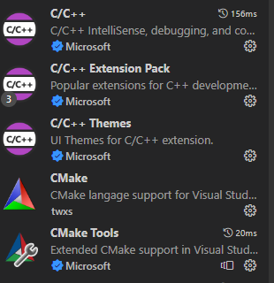

# vscode里怎么配置CMake项目

## Linux

以Ubuntu为例

首先我们得写好CMakeLists.txt

然后vscode里安装好cmake和C++开发相关插件：

如图：

1. C/C++ Extension Pack（安装好这个就够了）
2. CMake
3. CMake Tools

* 然后新建一个cmake项目
所谓新建其实就是新建一个文件夹然后在里面写好CMakeLists.txt，然后将源代码文件都放进文件夹里相应的目录，这个我熟，略，忘记了就看自己的cmake项目
* 然后打开CMakeLists.txt，然后鼠标右击菜单里选择 Configure
然后选择编译器和要编译的项目就行了

`/home/hrl/Desktop/MyProjects/MyPlugin/MySensorPlugin/workspace/lib`

## Windows

由于Win上已经有了Visual Studio这个默认支持cmake的，
所以Windows上使用这个方法配置cmake用处可能不是很大。
