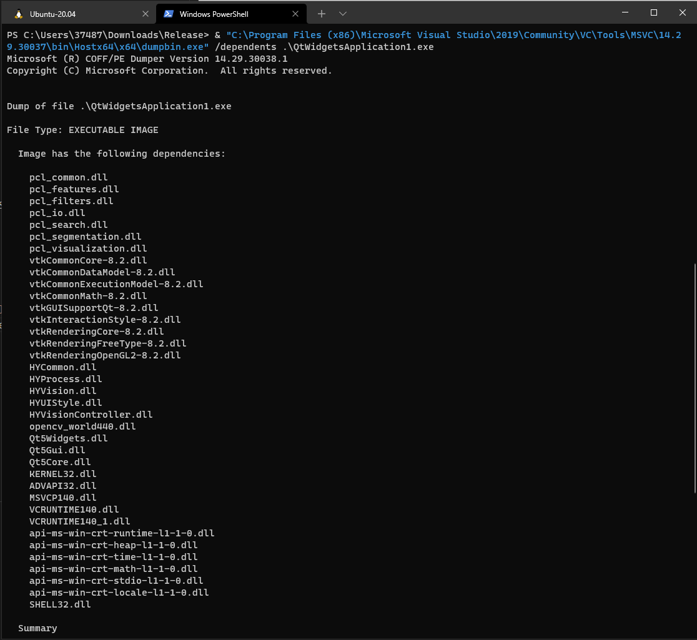

# visual studio 如何查找.exe文件所依赖的dll

首先我们需要按照visual studio，然后使用`dumpbin.exe`

如果没有的话则需要借助第三方开源工具

https://zhuanlan.zhihu.com/p/395557318

----

首先找到visual studio 安装路径：

```
C:\Program Files (x86)\Microsoft Visual Studio\2019\Community
```

然后找到`dumpbin.exe`的位置

```
C:\Program Files (x86)\Microsoft Visual Studio\2019\Community\VC\Tools\MSVC\14.29.30037\bin\Hostx64\x64\dumpbin.exe
```

然后cd到需要分析的文件所在的路径，输入命令：

```shell
 & "C:\Program Files (x86)\Microsoft Visual Studio\2019\Community\VC\Tools\MSVC\14.29.30037\bin\Hostx64\x64\dumpbin.exe" /dependents .\QtWidgetsApplication1.exe
```



输出结果如下：

```shell
Microsoft (R) COFF/PE Dumper Version 14.29.30038.1
Copyright (C) Microsoft Corporation.  All rights reserved.


Dump of file .\QtWidgetsApplication1.exe

File Type: EXECUTABLE IMAGE

  Image has the following dependencies:

    pcl_common.dll
    pcl_features.dll
    pcl_filters.dll
    pcl_io.dll
    pcl_search.dll
    pcl_segmentation.dll
    pcl_visualization.dll
    vtkCommonCore-8.2.dll
    vtkCommonDataModel-8.2.dll
    vtkCommonExecutionModel-8.2.dll
    vtkCommonMath-8.2.dll
    vtkGUISupportQt-8.2.dll
    vtkInteractionStyle-8.2.dll
    vtkRenderingCore-8.2.dll
    vtkRenderingFreeType-8.2.dll
    vtkRenderingOpenGL2-8.2.dll
    HYCommon.dll
    HYProcess.dll
    HYVision.dll
    HYUIStyle.dll
    HYVisionController.dll
    opencv_world440.dll
    Qt5Widgets.dll
    Qt5Gui.dll
    Qt5Core.dll
    KERNEL32.dll
    ADVAPI32.dll
    MSVCP140.dll
    VCRUNTIME140.dll
    VCRUNTIME140_1.dll
    api-ms-win-crt-runtime-l1-1-0.dll
    api-ms-win-crt-heap-l1-1-0.dll
    api-ms-win-crt-time-l1-1-0.dll
    api-ms-win-crt-math-l1-1-0.dll
    api-ms-win-crt-stdio-l1-1-0.dll
    api-ms-win-crt-locale-l1-1-0.dll
    SHELL32.dll

  Summary

        5000 .data
        3000 .pdata
       2D000 .rdata
        2000 .reloc
        1000 .rsrc
       48000 .text
```
