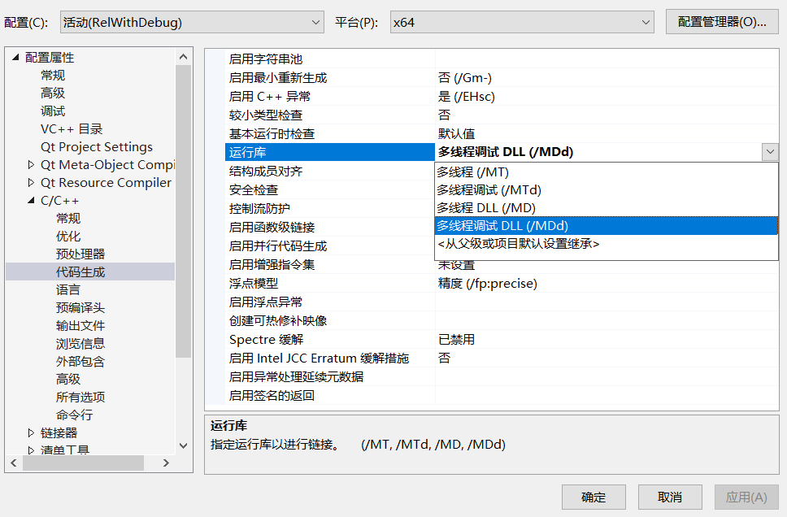
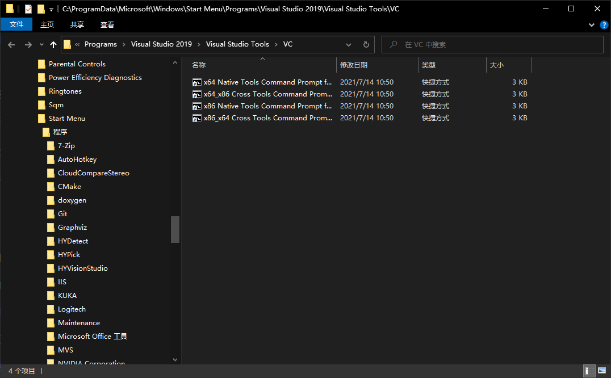

# visual studio常见错误总结

## 编译生成时遇到的错误

### “无法解析的外部符号”问题

```bash
错误LNK2001	
无法解析的外部符号 "__declspec(dllimport) public: __cdecl hy::recognizeObjectInImageTask::recognizeObjectInImageTask(void)" (__imp_??0recognizeObjectInImageTask@hy@@QEAA@XZ)	ROIDepthImageDemoPlugin	C:\hrl\MyWork\algorithmDemoPlugin-HRL\ROIDepthImageDemoPlugin\recognizeCloseObjectPlugin.obj	1	
```

### 常量里含有换行符的问题


解决办法：

将文件保存成`utf-8 with Bom`即有签名的那个，然后将换行符改为==制表符==

## C1900

项目所调用的dll的编译版本不同，可能需要更换或者重新编译

参考链接：
https://docs.microsoft.com/en-us/cpp/error-messages/compiler-errors-1/fatal-error-c1900?view=msvc-170


## 配置debug设置时常见错误

### LNK2038	检测到“_ITERATOR_DEBUG_LEVEL”的不匹配项: 值“2”不匹配值“0”(DarkStyle.obj 中)	

这个错误其实是在编译生成dll的时候所调用的dll是release版本，而工程是debug版本的

另外在设置项目多线程的时候：



上图中的**多线程调试DLL**才能生成我们想要的带调试信息的DLL

而多线程DLL则是生成release版本的DLL

### E2422 默认化的默认构造函数不能是 constexpr，因为对应的隐式声明的默认构造函数不会是 constexpr	

编译Qt项目时出现这个错误，检查一下是不是有qt项目没有设置qt好的版本和路径

## 打开项目的时候vs2019报错：配置“Debug|Win32”的 Designtime 生成失败。IntelliSense 可能不可用 出错内容

这种问题比较难查找错误来源，因为啥都没说就说不可用

但还是有方法可以找到错误来源的。

### 设置环境变量

打开：

`C:\ProgramData\Microsoft\Windows\Start Menu\Programs\Visual Studio 2019\Visual Studio Tools\VC`



打开上图中的`x64 Native Tools Command Prompt for VS 2019`

然后关闭vs，输入：

```bash
set TraceDesignTime=true
```

### 重启vs打开项目

重新打开vs

这个时候vs下方的输出窗口就会输出日志信息，不过这里的还不够完整，只是显示输出了日志文件。

### 找到错误信息

我们还需要到：

`C:\Users\Administrator\AppData\Local\Temp`去找日志文件

日志文件名称一般是：`[项目名称]_ProjectCache_133021773601266452.designtime.log`

这个文件里信息比较多，直接所搜==失败==然后就可以在附近找到相关的错误信息，并以此来处理问题了。

[参考链接](https://blog.csdn.net/zhoufei95/article/details/121030163)
