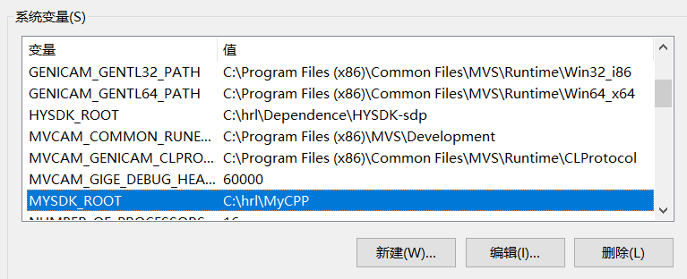

# 使用批处理文件配置系统环境

## 设置系统变量：

```batch
setx /M MYSDK_ROOT C:\hrl\MyCPP
```

使用管理员权限运行此脚本即可在系统环境变量下看到：



## 修改系统变量

### 在系统变量里添加变量

例如在path变量里添加

```batch
set addpath=yourpath
setx /m "path" "%addpath%;%path%"
```

addpath就是你要添加进path变量里的东西

## 检查系统变量里是否已经有

```batch
rem "尝试在MySDK_ROOT里寻找变量"

rem  tarDir 是  我们要寻找的变量
set tarDir=C:\hrl\MyCPP\PTA-Basic

set finded=false
set findedLib=false
rem "以下目的是查找环境变量里面是否已经设置了" 
:loop
for /f "tokens=1* delims=;" %%a in ("%MYSDK_ROOT%") do (
   if "%tarDir%"=="%%a" (
      set finded=true
	  echo "path find 1============== %tarDir%"
   ) 
   else (
       echo "path can not find 1============== %tarDir%"
   )
)

echo "%finded%"

pause
```
