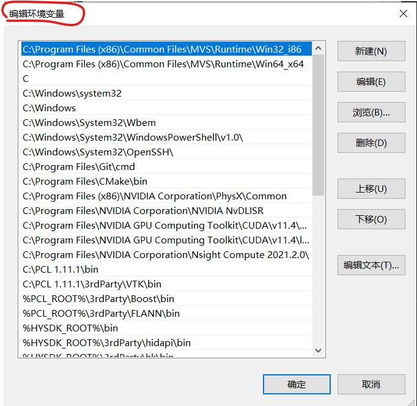

# win10如何解决Path变量从环境变量变为了系统变量

## 问题描述

由于一些修改环境变量的误操作（比如我就是用给Wix打包程序的时候修改Path变量却把原来的给覆盖掉了），Path变量会从环境变量变为系统变量。

直观的感受就是原来是可以多行编辑的，变成一行编辑的了。
其实编辑窗口左上角也有显示变化：

原来的样子（正常情况）：



现在的样子（不正常的情况）：


## 解决方案

很简单，在`Path`最前面加上：

```bash
C:\Windows\System64;
```

## Path 环境变量的备份

这是我G15电脑上的`Path`环境变量的备份。

```bash
C:\Program Files (x86)\Common Files\MVS\Runtime\Win32_i86;C:\Program Files (x86)\Common Files\MVS\Runtime\Win64_x64;C;C:\Windows\system32;C:\Windows;C:\Windows\System32\Wbem;C:\Windows\System32\WindowsPowerShell\v1.0\;C:\Windows\System32\OpenSSH\;C:\Program Files\Git\cmd;C:\Program Files\CMake\bin;C:\Program Files (x86)\NVIDIA Corporation\PhysX\Common;C:\Program Files\NVIDIA Corporation\NVIDIA NvDLISR;C:\Program Files\NVIDIA GPU Computing Toolkit\CUDA\v11.4\bin;C:\Program Files\NVIDIA GPU Computing Toolkit\CUDA\v11.4\libnvvp;C:\Program Files\NVIDIA Corporation\Nsight Compute 2021.2.0\;C:\PCL 1.11.1\bin;C:\PCL 1.11.1\3rdParty\VTK\bin;%PCL_ROOT%\3rdParty\Boost\bin;%PCL_ROOT%\3rdParty\FLANN\bin;%HYSDK_ROOT%\bin;%HYSDK_ROOT%\3rdParty\hidapi\bin;%HYSDK_ROOT%\3rdParty\hk\bin;%HYSDK_ROOT%\3rdParty\Widget\bin;%HYSDK_ROOT%\3rdParty\zlib\bin;%HYSDK_ROOT%\3rdParty\ABB\bin;%HYSDK_ROOT%\3rdParty\Aubo\bin;%HYSDK_ROOT%\3rdParty\Elite\bin;%QT_ROOT%\bin;%OPENCV_ROOT%\x64\vc15\bin;C:\PCL 1.11.1\3rdParty\Boost\bin;%PCL_ROOT%\3rdParty\Qhull\bin;C:\Program Files\OpenNI2\Tools;C:\Program Files\OpenNI2\Redist;%WEBSOCKETPP_ROOT%;%BOOST_ROOT%;%BOOST_ROOT32%;%GLFW_ROOT%\include;%GLFW_ROOT%\lib-vc2019;%GLEW_ROOT%\include;%GLEW_ROOT%\lib\Release\Win32;%GLEW_ROOT%;%GLM_ROOT%\glm;C:\Program Files\dotnet\;
```

----

```bash
C:\Program Files (x86)\Common Files\MVS\Runtime\Win32_i86;
C:\Program Files (x86)\Common Files\MVS\Runtime\Win64_x64;
C;
C:\Windows\system32;
C:\Windows;
C:\Windows\System32\Wbem;
C:\Windows\System32\WindowsPowerShell\v1.0\;
C:\Windows\System32\OpenSSH\;
C:\Program Files\Git\cmd;
C:\Program Files\CMake\bin;
C:\Program Files (x86)\NVIDIA Corporation\PhysX\Common;
C:\Program Files\NVIDIA Corporation\NVIDIA NvDLISR; 
C:\Program Files\NVIDIA GPU Computing Toolkit\CUDA\v11.4\bin; 
C:\Program Files\NVIDIA GPU Computing Toolkit\CUDA\v11.4\libnvvp;
C:\Program Files\NVIDIA Corporation\Nsight Compute 2021.2.0\;
C:\PCL 1.11.1\bin;
C:\PCL 1.11.1\3rdParty\VTK\bin;
%PCL_ROOT%\3rdParty\Boost\bin;
%PCL_ROOT%\3rdParty\FLANN\bin;
%HYSDK_ROOT%\bin;
%HYSDK_ROOT%\3rdParty\hidapi\bin;
%HYSDK_ROOT%\3rdParty\hk\bin;
%HYSDK_ROOT%\3rdParty\Widget\bin;
%HYSDK_ROOT%\3rdParty\zlib\bin;
%HYSDK_ROOT%\3rdParty\ABB\bin;
%HYSDK_ROOT%\3rdParty\Aubo\bin;
%HYSDK_ROOT%\3rdParty\Elite\bin;
%QT_ROOT%\bin;
%OPENCV_ROOT%\x64\vc15\bin;
C:\PCL 1.11.1\3rdParty\Boost\bin;
%PCL_ROOT%\3rdParty\Qhull\bin;
C:\Program Files\OpenNI2\Tools;
C:\Program Files\OpenNI2\Redist;
%WEBSOCKETPP_ROOT%;
%BOOST_ROOT%;
%BOOST_ROOT32%;
%GLFW_ROOT%\include;
%GLFW_ROOT%\lib-vc2019;
%GLEW_ROOT%\include;
%GLEW_ROOT%\lib\Release\Win32;
%GLEW_ROOT%;
%GLM_ROOT%\glm;
C:\Program Files\dotnet\;
```
