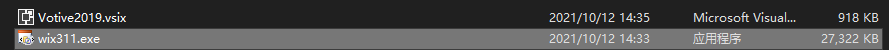
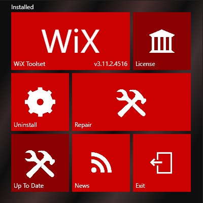
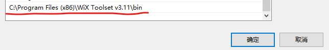

# Wix如何打包msi程序包

## Wix的安装

点击安装程序即可:



安装程序如图：



点击install安装（我这里已经装过了，所以显示的是Uninstall）

## 配置环境变量

为了以后能够在PC的任何位置都运行wix来打包程序，我们需要配置Wix的环境变量。

很简单，把Wix的安装目录下的`\bin`目录加入到系统的Path变量中即可。

一般Wix默认的安装目录是：
```bash
C:\Program Files (x86)\WiX Toolset v3.11
```

环境变量配置结果：



## 实例程序

这个实例程序可通过再vs2019里新建一个`wix setup`工程来获得，在工程里名为`Product.wxs`

```xml
<?xml version="1.0" encoding="UTF-8"?>
<Wix xmlns="http://schemas.microsoft.com/wix/2006/wi">
    <Product Id="*"
        Name="My Software"
        Language="1033"
        Version="1.0.0.0"
        Manufacturer="My Company"
        UpgradeCode="889e2707-5235-4d97-b178-cf0cb55d8ab8">
    
        <Package InstallerVersion="200"
            Compressed="yes"
            InstallScope="perMachine"/>
    
        <MajorUpgrade DowngradeErrorMessage="A newer version of [ProductName] is already installed." />
    
        <MediaTemplate/>

        <Feature Id="ProductFeature"
            Title="MyFirstWixProject" Level="1">

            <ComponentGroupRef Id="ProductComponents"/>
        </Feature>
    </Product>

    <Fragment>
        <Directory Id="TARGETDIR" Name="SourceDir">
            <Directory Id="ProgramFilesFolder">
                <Directory Id="INSTALLFOLDER"
                    Name="My Software" />
            </Directory>
        </Directory>
    </Fragment>

    <Fragment>
        <ComponentGroupId="ProductComponents"
            Directory="INSTALLFOLDER">
            <!-- TODO: Remove the comments around this Component element and the ComponentRef below in order to add resources to this installer.-->
            <!-- <Component Id="ProductComponent"> -->
            <!--TODO: Insert files, registry keys, and other resources here.-->
            <!--</Component>-->
        </ComponentGroup>
    </Fragment>
</Wix>
```

打包命令：

```bash
candle.exe ./Product.wxs
light.exe  ./Product.wixobj
```
