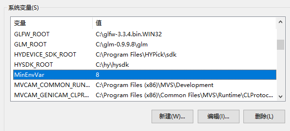
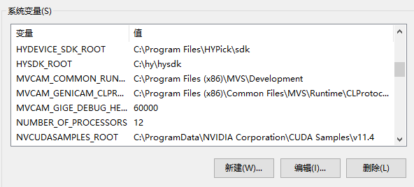

# Wix如何设置环境变量

平时我们使用别的软件或者SDK的时候，有时会用到安装程序。
这时我们就开心了，因为只要按照里面的提示走，那么安装多半会很顺利的。

一般在SDK的安装程序（例如opencv）里会有设置环境变量的选项。

## 示例代码

```xml
<?xml version="1.0" encoding="UTF-8"?>
<Wix xmlns="http://schemas.microsoft.com/wix/2006/wi">
    <Product Id="a960cf35-0779-43e8-923b-35638f2bfc42" Name="Minimal" Language="2052" Version="1.0.0.0" Manufacturer="Geffzhang"
           UpgradeCode="0bf7e020-5bbd-4a06-8e39-e715999edbf5">
        <Package InstallerVersion="200" Compressed="yes" Description="Minimal Windows Installer Sample"
             Comments="This installer database contains the logic and data required to install Minimal Windows Installer Sample."/>
 
        <Media Id="1" Cabinet="media1.cab" EmbedCab="yes" />
    
    <!-- 注意1 -->
    <Property Id="EnableEV" Value="1"></Property>
    
        <Directory Id="TARGETDIR" Name="SourceDir">
            <Directory Id="ProgramFilesFolder">
                <Directory Id="INSTALLLOCATION" Name="Minimal">
          <Component Id="Component1"
                     Guid="{1781A625-8ACB-45E7-A8BA-219D81760B2E}">
            <CreateFolder />
            
            <!-- 注意2 -->
            <Environment Id="TestMinVar"
                         Action="set"
                         Part="all"
                         Name="MinEnvVar"
                         Permanent="no"
                         System="yes"
                         Value="8" />
          </Component>
                </Directory>
            </Directory>
        </Directory>
 
    
        <Feature Id="ProductFeature" Title="Minimal" Level="1">
      <ComponentRef Id="Component1" />
        </Feature>
    
    <!-- 注意3 -->
    <InstallExecuteSequence>
      <WriteEnvironmentStrings>EnableEV=1</WriteEnvironmentStrings>
      
    </InstallExecuteSequence>

    <!-- 给安装程序添加UI界面的 -->
    <Property Id="WIXUI_INSTALLDIR" Value="INSTALLLOCATION" />
    <UIRef Id="WixUI_InstallDir" />
 
 
  </Product>
</Wix>
```

## 添加环境变量的过程

1、设置`Property`元素

2、设置`Environment`元素

3、设置`InstallExecuteSequence`元素

## 我自己的示例程序

```xml
<?xml version="1.0" encoding="UTF-8"?>
<Wix xmlns="http://schemas.microsoft.com/wix/2006/wi">
  <!-- 设置项目基本信息 -->
  <!-- Name：项目名称 -->
	<Product Id="*" Name="HYDeviceSDKSetup" Language="1033" Version="1.0.0.0" Manufacturer="HP Inc." UpgradeCode="bcea150c-f90d-4359-9a1c-f9c1f96a3436">
		<Package InstallerVersion="200" Compressed="yes" InstallScope="perMachine" />

		<MajorUpgrade DowngradeErrorMessage="A newer version of [ProductName] is already installed." />
		<MediaTemplate />

		<Feature Id="ProductFeature" Title="CompleteSetup" Level="1">
			<ComponentGroupRef Id="ProductComponents" />

      <ComponentGroupRef Id="IncludeComponents" />

      <ComponentGroupRef Id="SrcComponents" />
		</Feature>

    <InstallExecuteSequence>
      <WriteEnvironmentStrings>EnableEV=1</WriteEnvironmentStrings>

    </InstallExecuteSequence>
	</Product>
  
	<Fragment>

    <Property Id="EnableEV" Value="1"></Property>
    
		<Directory Id="TARGETDIR" Name="SourceDir">
			<Directory Id="ProgramFilesFolder">
        <Directory Id="INSTALLFOLDER" Name="HYDeviceSDK">
          <Directory Id="INCLUDEFOLDER" Name="include"/>

          <Directory Id="SRCFOLDER" Name="src"/>
          
        </Directory>
			</Directory>
		</Directory>
	</Fragment>

	<Fragment>
		<ComponentGroup Id="ProductComponents" Directory="INSTALLFOLDER">
			<!-- TODO: Remove the comments around this Component element and the ComponentRef below in order to add resources to this installer. -->
			<!-- <Component Id="ProductComponent"> -->
				<!-- TODO: Insert files, registry keys, and other resources here. -->
			<!-- </Component> -->
		</ComponentGroup>

    <ComponentGroup Id="IncludeComponents" Directory="INCLUDEFOLDER">
      <Component Id="IncludeHeader" Guid="{307EEAF4-94E2-4902-8E3D-E769600D7BE7}">
        <File Name="HYSensorPlugin.h" src="./include/device/HYSensorPlugin.h"/>
        <File Name="HYWebSocketPlugin.h" src="./include/device/HYWebSocketPlugin.h"/>

        <Environment Id="TestMinVar"
                         Action="set"
                         Part="all"
                         Name="MinEnvVar"
                         Permanent="no"
                         System="yes"
                         Value="8" />
        
      </Component>
    </ComponentGroup>

    <ComponentGroup Id="SrcComponents" Directory="SRCFOLDER">
      <Component Id="SourceFile" Guid="{DDAA069A-1CC1-4A88-89E6-613E9976BC3F}">
        <File Name="HYSensorPlugin.cpp" src="./src/device/HYSensorPlugin.cpp"/>
        <File Name="HYWebSocketPlugin.cpp" src="./src/device/HYWebSocketPlugin.cpp"/>
      </Component>
    </ComponentGroup>
	</Fragment>
</Wix>
```

安装后查看环境变量如图：



卸载后可删除环境变量：


