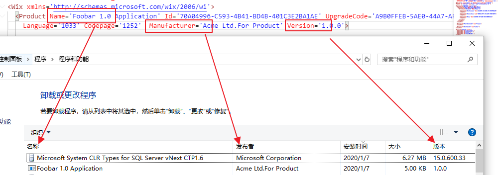
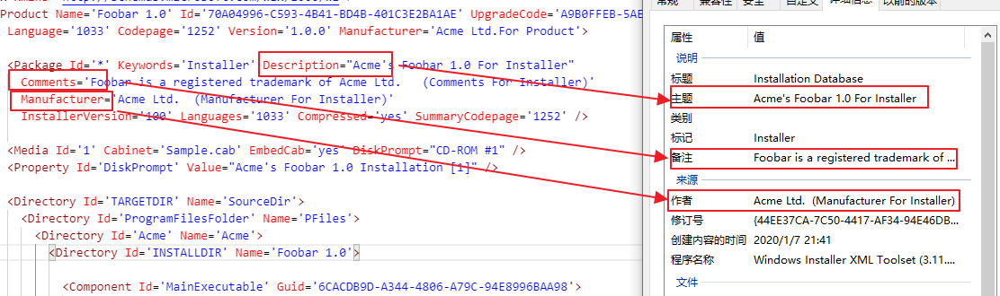
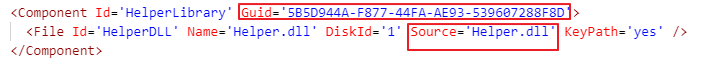
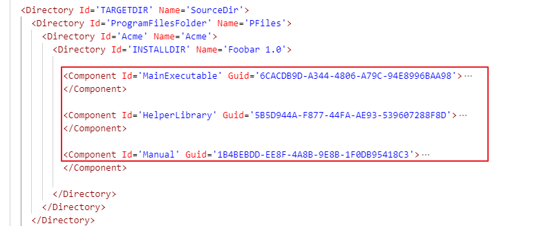
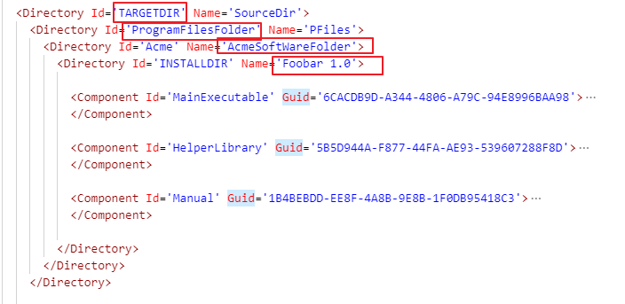
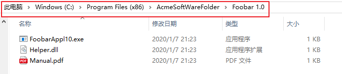
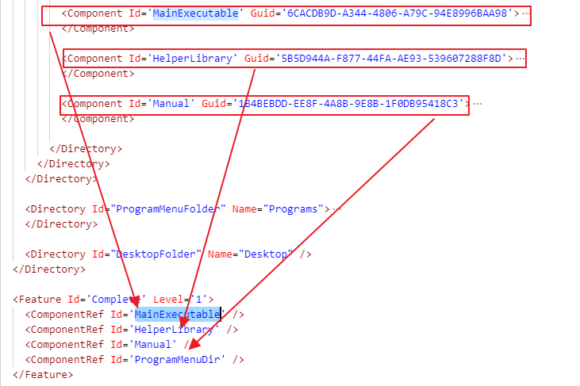

# wxs代码解释

这是一种类xml语言。

参考连接：https://www.cnblogs.com/chenyingzuo/p/12164131.html

## 元素介绍

### Product

Product 元素主要描述安装后的应用程序的信息。它需要两个唯一的GUID，一个是Id，一个是UpgradeCode：

Id：即product code，代表一个
UpgradeCode： 代表一个产品，相同产品安装包以后不需要再修改这个GUID



### Package

一般是包含在product里面的。

Package元素主要是描述安装包本身的信息，它有个比较重要的Id属性，只要不同安装包都需要一个唯一的GUID。

wix为了方便允许使用*代表GUID，编译时会被替换成GUID。

还有一些描述信息如下：



### Component

Component元素主要代表安装的文件，它需要一个唯一的GUID。

一个Component元素可以包含一个File元素，一个File可以指向一个文件，用Source属性标记这个文件的位置。

安装包编译后会将文件打包进安装包，安装包负责安装文件。



我们可以这样一条一条的罗列出需要安装的文件，整理出一组Component元素。



如果这一组文件需要装到用户机器上的某个文件夹下面，需要在wix里面写好，可以参考这个嵌套顺序写：

```bash
TARGETDIR > ProgramFilesFolder > xxx > xxx > ...
```

`ProgramFilesFolder` 是一个内建关键字，代表用户机器的C盘下的ProgramFiles文件夹

举例：

```bash
TARGETDIR > ProgramFilesFolder > AcmeSoftWareFolder > Foobar 1.0
```



实际安装后的目录如下：



可以看到和之前我们在wxs文件里面写的结构一致。

还需要注意，要使用 ComponentRef 的Id属性引用刚才的Component, 并且包在 Feature 元素里，安装包才会装这些Component




