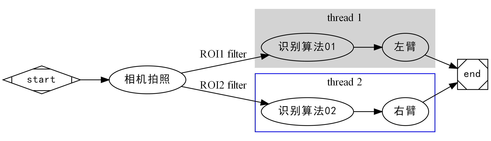

# 用Graphviz画流程图

## Graphviz

在尝试时可以把 dot 换成 circo, fdp, neato, osage, twopi 这几种来尝试效果

无法用`Markdown Preview Enhance`来渲染出图，因为GitHub上的访问不了

```
digraph G {

    subgraph cluster_0 {
        style=filled;
        color=lightgrey;
        node [style=filled,color=white];
        a0 -> a1 -> a2 -> a3;
        label = "process #1";
    }

    subgraph cluster_1 {
        node [style=filled];
        b0 -> b1 -> b2 -> b3;
        label = "process #2";
        color=blue
    }
    start -> a0;
    start -> b0;
    a1 -> b3;
    b2 -> a3;
    a3 -> a0;
    a3 -> end;
    b3 -> end;

    start [shape=Mdiamond];
    end [shape=Msquare];
}
```

----

* 我自己的
* 生成命令： `dot -Tpng dot-demo.dot -o dot-demo.png`

```
digraph G {

    subgraph cluster_0 {
        style=filled;
        color=lightgrey;
        node [style=filled,color=white];
        "algorithm 1" -> "robot 1";
        label = "thread 1";
    }

    subgraph cluster_1 {
        node [style=filled];
        "algorithm 2" -> "robot 2";
        label = "thread 2";
        color=blue
    }
    start -> sensor;
    sensor -> "algorithm 1";
    sensor -> "algorithm 2";
    "robot 1" -> end;
    "robot 2" -> end;

    start [shape=Mdiamond];
    end [shape=Msquare];
}
```



## 使用本地的Graphviz编译器出图

编辑好如上代码的文件后，就可以在终端使用dot命令出图了（==前提是安装的时候将graphviz路径添加到系统路径里去==）

### 生成命令

```bash
dot -Tpng filename.dot -o filename.png
```

### 设置分辨率

```bash
dot -Tpng -Gdpi=300 filename.dot -o filename.png
```

这是dpi为300

### 设置方向

```
rankdir="LR";
```

```
digraph G {
    rankdir="LR";
    
    subgraph cluster_0 {
        style=filled;
        color=lightgrey;
        node [style=filled,color=white];
        "algorithm 1" -> "robot 1";
        label = "thread 1";
    }

    subgraph cluster_1 {
        node [style=filled];
        "algorithm 2" -> "robot 2";
        label = "thread 2";
        color=blue
    }
    start -> sensor;
    sensor -> "algorithm 1";
    sensor -> "algorithm 2";
    "robot 1" -> end;
    "robot 2" -> end;

    start [shape=Mdiamond];
    end [shape=Msquare];
}
```

## 中文支持

https://blog.csdn.net/lizzy05/article/details/88543328

其实主要就是添加以下两行代码：

```bash
node [fontname="SimHei"]
edge [fontname="SimHei"]
```

```bash
digraph G {
    rankdir="LR";

    node [fontname="SimHei"]
    edge [fontname="SimHei"]
    
    start [label="待测目标物\n进入"]

    plc [label="PLC"]

    sensor [label="相机拍照"]
    
    algo [label="算法计算并识别"]
    
    end [label="输出结果"]
        
    start -> plc;
    plc -> sensor[label="ROI撒"];
    sensor -> algo[label="ROI"];
    algo->end
    
    start [shape=Mdiamond];
    end [shape=Msquare];
}
```
