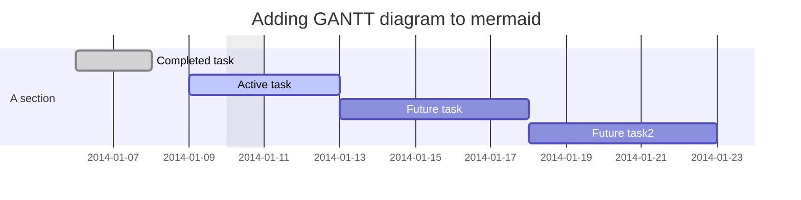
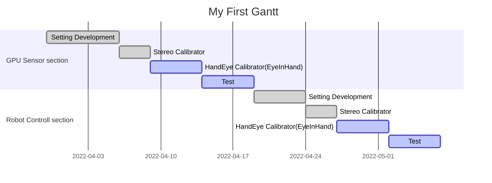

# 甘特图

## mermaid

```mermaid
gantt
dateFormat  YYYY-MM-DD
title Adding GANTT diagram to mermaid
excludes weekdays 2014-01-10

section A section
Completed task            :done,    des1, 2014-01-06,2014-01-08
Active task               :active,  des2, 2014-01-09, 3d
Future task               :         des3, after des2, 5d
Future task2               :         des4, after des3, 5d
```

官方链接：
https://mermaid-js.github.io/mermaid/#/

```mermaid
gantt
dateFormat  YYYY-MM-DD
title My First Gantt

section GPU Sensor section
Setting Development            :done,    des1, 2022-03-30,2022-04-06
Stereo Calibrator               :done,  des2, after des1, 3d
HandEye Calibrator(EyeInHand)          :active,         des3, after des2, 5d
Test               :active,         des4, after des3, 5d

section Robot Controll section
Setting Development            :done,    rob1, after des4,5d
Stereo Calibrator               :done,  rob2, after rob1, 3d
HandEye Calibrator(EyeInHand)          :active,         rob3, after rob2, 5d
Test               :active,         rob4, after rob3, 5d

```
