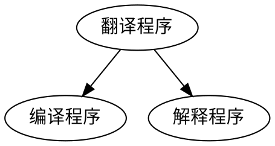
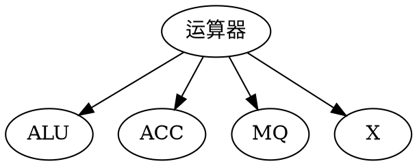
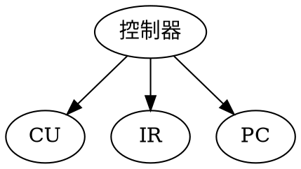
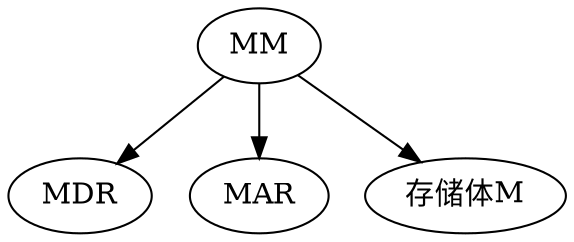
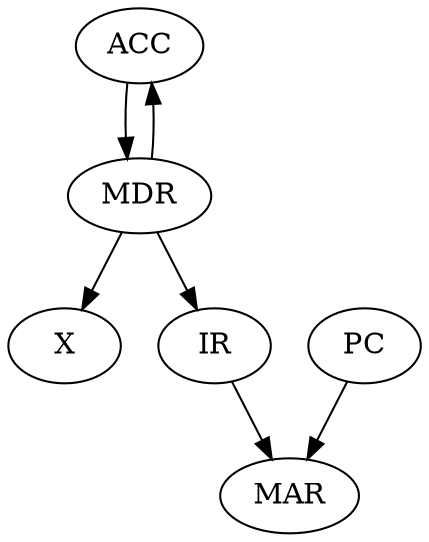

# 计算机组成原理 （一） 概论 

![image_1d3bc8jkl193be591euqoq21pg99.png-170.7kB][1]

## 什么是计算机系统？
计算机系统由软硬件两大部分组成。

### 计算机系统的层次结构如下：

![image_1d1no1ou04noe21kkj1t0ij0o19.png-58kB][2]


**虚拟机器（M4)**：

用**翻译程序**将高级语言翻译成汇编语言

翻译程序有两种
```
graph TD
1(翻译程序) --> 2(编译程序)
1 --> 3(解释程序)
```



编译程序：全部翻译后执行

解释程序：翻译一句，执行一句（边翻译边执行）

**虚拟机器（M3）**：

用汇编语言翻译成机器语言程序

**汇编程序**：

将汇编语言翻译成机器语言。

**虚拟机器（M2）**：

用机器语言来解释操作系统，即运行操作系统软件

**实际机器（M1）**：

用微指令解释机器指令,即机器语言机器

可以直接运行机器语言

**微程序机器（M0）**：
有硬件直接执行指令


---


## 计算机组成与计算机体系研究有什么区别？
**计算机体系研究**：
能够被程序员看到的计算机系统的属性（包括指令集、数据类型、存储器寻址技术、I/O机理等）。
不同层次的程序员所看到的计算机系统的属性也不一样。

**计算机组成**：
如何实现上面所述的计算机系统的属性

例子：
对于一台计算机

有无乘法操作-->计算机体系

乘法操作怎么实现-->计算机组成原理

---
## 冯·诺依曼计算机的特点
1. 计算机由五大部件组成（运算、控制、输入、输出、存储）
2. 指令和数据以同等地位存于存储器，可按地址寻访
3. 指令和数据用二进制表示
4. 指令由操作码和地址码组成
5. 存储程序
6. 以运算器为中心

CPU可细分为运算器与控制器

运算器还可细分：



控制器细分：



主存储器细分：



---
## 本章的英语缩写
CPU：中央处理器

包括：ALU（算术逻辑单元）+ 控制单元（CU）

除了ALU之外还有两个运算器

ACC：累加器

MQ：乘商寄存器

X：操作数寄存器

CU：

还包括两部分：

PC：程序计数器

IR：指令寄存器

I/O：输入输出设备（外部设备）

MM：主存储器

包括：

MAR：存储器地址寄存器

MDR：存储器数据寄存器

---
## 计算机的工作过程

### 运算过程

在运算器里进行

### 执行指令

在控制器里进行

---
## 运算速度的评估单位
MIPS：
百万条指令每秒

CPI：
执行一条指令的时钟周期

FLPOS:
浮点运算次数每秒

---
## 单元练习错题（课本上的）

### 9.用以指定待执行指令的地址的是
A.指令寄存器    B.数据计数器

C.程序计数器    D.累加器

我的答案：A

正确答案：C

解析：（书本16页）
IR存的是当前要执行的指令，而它的地址则是存在PC里头

### 10.计算机与日常使用的袖珍计算器的本质区别在于
A.运算速度的高低    B.存储器容量的大小

C.规模的大小    D.自动化程度的高低

我的答案：C

正确答案：
D.自动化程度的高低

### 12.用户与计算机的交互界面是
A.CPU   B.外部设备

C.应用程序  D.系统程序

我的答案：D

正确答案：
B.

解析：因为用户只有通过使用计算机交互。错音主要是因为“界面”这个词使得我想歪了，以为是程序里的那种界面（实际上界面是显示在显示器上的，而显示器就是外部设备啊！）

### 17.下列语句中？是正确的
A.数据库属于系统软件    

B.磁盘驱动器只有输入功能

C.评估计算机的执行速度可以用每秒执行的指令书为判断依据  

D.个人计算机是小型机

我的答案：D

正确答案：C

解析：
数据库属于应用软件
磁盘驱动器同时具有输入输出功能
C是对的
D.个人计算机是微型机

### 24.一般8位的微型机系统以16为位来表示地址，则可用的地址一共有？
A.256   B.65535

C.65536     D.131072

我的答案：B

正确答案：C

解析：
也就是一共有2的16次方个空间，即65536个，错因可能是记成了（0~65535）的65535了。

### 26.一片 1 MB的次磁盘能存储？的数据
A.$10^6$字节    B.$10^{-6}$字节


C.$10^9$字节    D.$2^{20}$字节

我的答案：A

正确答案：D

解析：
应该是$1024 \times 1024 = 2^{10} \times 2^{10} = 2^{20}$
虽然约等于$10^6$，但是不够准确，错因可能是做的太快，没看到后面的D选项是更加正确的。

### 27.计算机中？负责指令译码
A.算数逻辑单元  B.控制单元

C.存储器译码电路    D.输入输出译码电路

我的答案：C

正确答案：B

### 40.将汇编语言翻译成机器语言需借助于？
A.编译程序  B.编辑程序

C.汇编程序  D.连接程序

我的答案：A

正确答案：C

解析：

### 41.在CPU中跟踪指令后继地址的寄存器是？
A.MAR   B. IR

C.PC    D.MDR

我的答案：D

正确答案：C

  [1]: http://static.zybuluo.com/Arbalest-Laevatain/96kxz2mpb6v9azoorhn81czk/image_1d3bc8jkl193be591euqoq21pg99.png
  [2]: http://static.zybuluo.com/Arbalest-Laevatain/vt8jc3gfe2mc7e4lpornqloq/image_1d1no1ou04noe21kkj1t0ij0o19.png
  
# 《王道》

## 《王道》第一章 总结

### 《王道》第一节


### 《王道》第二节

### 《王道》第三节

专业术语

1、系列机

2、兼容

3、软件可移植性

4、固件

## 《王道》习题

### 第一节

（P3）4. 只有当程序执行时才将源程序翻译成机器语言，并且一次只能翻译一行语句，边翻译边执行的是（ ），把汇编语言源程序转变为机器语言程序的过程是（ ）

1、编译 2、目标 3、汇编 4、解释

正确答案：4、3

### 第二节

1、完整的计算机系统应该包括（）

A、运算器、存储器、控制器

B、外部设备和主机

C、主机和应用程序

D、配套的硬件设备和软件系统

正解：D

2、冯诺依曼机的基本工作方式是（ ）

A 控制流驱动方式

B、按地址访问并顺序执行命令

C、微程序控制方式

D、数据流驱动方式

正解：A

注：
控制流驱动方式

微程序控制方式

数据流驱动方式

4、冯诺依曼计算机中指令和数据均以二进制形式存放在存储器中，CPU区分它们的依据是（  ）

A、指令操作码的译码结果
B、指令和数据的寻址方式
C、指令周期的不同阶段
D、指令和数据的存储单元

正解：C

解析：
对于A选项，CPU只在确定它是指令后才能进行译码操作；故排除
B、C、D：除了指令周期的不同阶段之外，其他的都一样，故不能作为区分的依据

8、CPU不包括（）

A、地址寄存器
B、指令寄存器（IR）
C、地址译码器
D、通用寄存器

正解：C

解析：
地址译码器（C）是主存的一部分，主存通过地址译码器才根据传来的地址找到对应的存储单元访问。
地址寄存器（A）易错选，因为地址译码器原来是在主存的，现在的计算机把它放到CPU里去了。

10、在运算器中不包括（    ）

A、状态寄存器
B、数据总线
C、ALU
D、地址寄存器

正解：D

解析：
（C）运算器的核心部分就是ALU；地址寄存器（D）在CPU内，但并没有集成到运算器和控制器当中，它是用来保存当前CPU所访问的内存单元的地址。由于内存和CPU之间存在速度上的差异，所以必须使用地址寄存器来保存地址信息。
数据总线（Ｂ）因为内部需要传输数据，所以肯定有
状态寄存器（A），因为需要用其来记录？状态

15、关于编译程序和解释程序，下列说法错误的事（    ）

A、编译程序和解释程序的功能都是把高级语言转换成机器语言
B、编译程序编译时间较长，运行速度较快
C、解释程序方法简单，运行速度也快
D、解释程序将源程序翻译成机器语言，且翻译一条执行一条

正解：C

17、下列叙述正确的是（    ）
A、寄存器的设置对汇编语言是透明的
B、实际应用程序的测试结果是能够全面代表计算机的性能
C、系列机的基本特性是指令系统向后兼容
D、软件和硬件在逻辑功能上是等价的

正解：C

解析：
A：寄存器的设置对汇编语言是不透明的，汇编语言可以对寄存器进行操作
B：能够全面代表计算机性能的是实际运行软件的情况
D：软件和硬件在逻辑上是等效但不等价；

C：向后兼容是时间上向后兼容，即新机器兼容老机器的指令系统

### 第三节

7、32位微机是指该计算机所用CPU（  ）

A、具有32位寄存器
B、能同时处理32位的二进制数
C、具有32个寄存器
D、能处理32个字符

正解：B

解析：
B：计算机的位数就是机器字长，也就是计算机一次能处理的二进制数的长度
**注意**：操作系统的位数是指操作系统可寻址的位数，与机器字长不同。

9、若一台计算机的机器字长为4字节，则表明该机器（  ）

A、能处理的数值最大为4位十进制数
B、能处理的数值最多为4位二进制数
C、在CPU中能够作为一个整体处理32位的二进制代码
D、在CPU中运算的结果为大为$2^{32}$

正解：C

解析：
机器字长是计算机内部一次可处理的二进数的位数，故该计算机可以能够以一个整体处理32位二进制代码

12、CPU的CPI与下列（  ）因素无关

A、时钟频率
B、指令周期
C、状态寄存器
D、中断周期

正解：A

解析：
CPI是执行一条指令所需的时钟周期数；系统结构、指令集、计算机组织都会影响CPI，而时钟频率只会影响指令执行的快慢，而不会影响执行指令所需的指令周期数。

15、下列关于“兼容”的描述，正确的是（  ）

A、指计算机软件和硬件之间的通用性，通常在同一系列的不同型号的计算机间存在
B、指计算机软件或硬件的通用性，即它们在任何计算机间都可以用
C、指计算机软件或硬件的通用性，通常在同一系列不同型号的计算机间通用
D、指软件在不同系列计算机中可以通用，而硬件不能通用

正解：C

解析：
兼容指计算机软件或硬件的通用性，通常存在于同一系列的不同型号的计算机。故选项A、D项错。选C。

16、下列说法，正确的是（  ）

1、在微型计算机的广泛应用之中，会记电算化属于科学计算方面的应用
2、决定计算机计算精度的主要技术是计算机的字长
3、计算机“运算速度”指标的含义是每秒能执行多少条操作系统的命令
4、利用大规模集成电路技术把计算机的运算部件和控制部件坐在一块电路上，这样的一块芯片称为单片机

A、13
B、24
C、2
D、134

正解：C

解析：
A、明显错
B、明显对
C、运算速度是指每秒能执行的指令
D、那是CPU，单片机还包括了其他部件

#### 17、某计算机的主频为1.2GHz，其指令分为4类，它们在基准程序中所占的比例及CPI如下：


|  指令类型  | 所占比例   | CPI   |
| --- | --- | --- |
|   A | 50%   | 2   |
|   B |   20% |   3 |
|   C |   10% |   4 |
|   D |   20% |    5|

该机的MIPS数为？

A、100
B、200
C、400
D、600

正解：C

解析：
基准程序的CPI$ = 2 \times 0.5 + 3 \times 0.2 + 4 \times 0.1 + 5 \times 0.2 = 3$
$$MIPS = \frac{1.2 \times 10^3 M}{3} = 400 $$
故选C

#### 18、假定基准程序A在某计算机上运行时间为100s，其中90s为CPU时间，其余为I/O时间。若CPU速度提高50%，I/O速度不变，则运行基准程序A所耗费的时间是？

A、55s
B、60s
C、65s
D、70s

正解：D

解析：
程序A运行时间为100s，CPU提升50%，则其中90s的CPU时间变为$= \frac{90}{1.5} = 60$，再加上I/O的10s，则为70s，故选D

#### 19、程序P在机器M上的执行时间是20s，编译优化后，P执行的指令数减少到原来的70%，而CPI增加到原来的1.2倍，则P在M上的运行时间为？

A、8.4s
B、11.7s
C、14s
D、16.8s

正解：D

解析：
首先要理解这里额度执行时间是怎么算的。
设执行时间为T，原来的指令数为x，原来的CPI为C，CPU频率为K，则有
$T = \frac{C \cdot x}{K}$
指令数减少70%，CPI变为原来的1.2倍，则：
$$T’ = \frac{70% x \cdot 1.2 C}{K} = 0.84 T = 0.84 \times 20s = 16.8s$$
故选D

#### 20、假定计算机M1和Ｍ2具有相同的指令集体系结构（ISA），主频分别为1.5GHz和1.2GHz。在Ｍ1，M2上运行某基准程序P，平均CPI分别为2和1，则程序P在M1，M2上运行时间的比值是？

A、0.4
B、0.625
C、1.6
D、2.5

正解：C

解析：
设P的指令数为x，在M1上的时间：$T_1 = \frac{2x}{1.5}$，在M2上的时间：$T_2 = \frac{x}{1.2}$
则比值为：$\frac{T_1}{T_2} = \frac{2}{1.5} \div \frac{1}{1.2} = 1.6$
故选C

### 第三节 综合题

1、设主存容量为$64K \times 32$位，且指令字长、存储字长、机器字长三者相等。写出如图1.4所示个寄存器的位数，并指出那些寄存器之间有信息通路

解：

寄存器有：
ACC、MQ、X；均为32位
IR（32）、PC（16）
MAR（16）、MDR（32）

有信息通路：



2、用一台40MHz的处理器执行标准测试程序，它所包含的混合指令数和响应所需额度时间周期如下。求有效CPI、MIPS、程序执行时间（设I为程序的指令数）


|  指令类型  |CPI    | 指令混合比   |
| --- | --- | --- |
|   算术和逻辑 |   1 | 60%   |
|  高速缓存命中的访存  | 2   | 18%   |
|  转移  |    4|    12%|
|   高速缓存失败的访存 |  8  | 10%   |


解：

有效CPI：
$$= 0.6 \times 1+ 0.18 \times 2 + 0.12 \times 4 + 0.1 \times 8 = 2.24$$

$$MIPS = \frac{40M}{2.24} = 17.9$$

程序的执行时间：
$$T = \frac{2.24 \times I}{40M} = 0.056 \times 10^{-6} I$$
$= 5.6 \times 10^{-8} I$秒

3、微机A和B采用不同主频CPU，片内逻辑相同，若A机器的CPU主频为8MHz，B为12MHz，则
1. A机器的时钟周期为？
2. 若A机器的平均指令执行速度为0.4MIPS，则A机的平均指令周期为？
3. B机器的平均指令执行速度为？

解：
1. A的时钟周期：$= \frac{1}{8M} = 0.125 \times 10^{-6}$秒
2. A的平均指令周期：$= \frac{1}{0.4M} = 2.5 \times 10^{-6}$秒
3. 先通过第二问计算出CPI：$MIPS = \frac{8M}{CPI}$;$CPI = \frac{8}{0.4} = 20$；B的平均指令执行速度：$=\frac{12M}{20} = \frac{3}{5} = 0.6MIPS$

第三问还可以：$$= 0.4 \times \frac{12}{8} = 0.6MIPS$$

4、某台计算机只有Load/Store指令能够对存储器进行读写操作，其他指令只对寄存器进行操作，根据实验，已知每条指令所占比例及CPI如下：


|  指令类型  |指令所占比例    | CPI   |
| --- | --- | --- |
|  算术逻辑指令  | 43%   | 1   |
|   Load指令 |  21%  |2    |
|   Store指令 |  12%  | 2   |
|   转移指令 |   24% |   2 |


（1）求平均CPI？
（2）假设程序由M条指令组成。算术逻辑运算中25%的指令的两个操作数中的一个已在寄存器中，另一个必须在算术逻辑指令执行前用Load指令从存储器取到寄存器。因此有人建议增加另一种指令，其特点是一个操作数取自寄存器，另一个操作数取自存储器，假设这种类型指令的CPI为2；同时，转移指令的CPI为3.求新指令系统的平均CPI？

解：
（1）：$$\overline{CPI} = 0.43 \times 1 + 0.21 \times 2 + 0.12 \times 2 + 0.24 \times 2 = 1.57$$

（2）：由题目意思可得新指令占旧算术逻辑指令的25%，即$0.43M \times 0.25 = 0.1075M$，且由于其中包含了Load指令，故原来的Load指令得减少$0.1075M$, 这样总的指令数就减少了,变成：$(1-0.1075)M = 0.8925M$，新指令系统列表如下：


|  指令类型  |占比    |CPI    |
| :---: | :---: | :---: |
|   算术逻辑指令 |   $\frac{0.43M \times (1-0.25)}{0.8925M} = 0.3613$ | 1   |
|   新指令 | $\frac{0.43M \times 0.25}{0.8925M} = 0.1204$  |   2 |
|   Load |  $\frac{0.21M - 0.43M \times 0.25}{0.8925M}=0.1148$  | 2   |
|   Store | $\frac{0.12M}{0.8925M} = 0.1346$   | 2   |
|转移| $\frac{0.24M}{0.8925M} = 0.2689$|3|

$$\overline{CPI} = 0.3613 + 0.1204 \times 2 + 0.1148 \times 2 + 0.1345 \times 2 + 0.2689 \times 3 = 1.9076$$

## 易混淆的知识点和问题

### 1、软件和硬件等效吗？等价吗？

### 2、主频高的CPU一定快吗？

### 3、机器字长、指令字长、存储字长的联系与区别？

### 4、基准程序跑得越快就能说明机器性能越好吗？