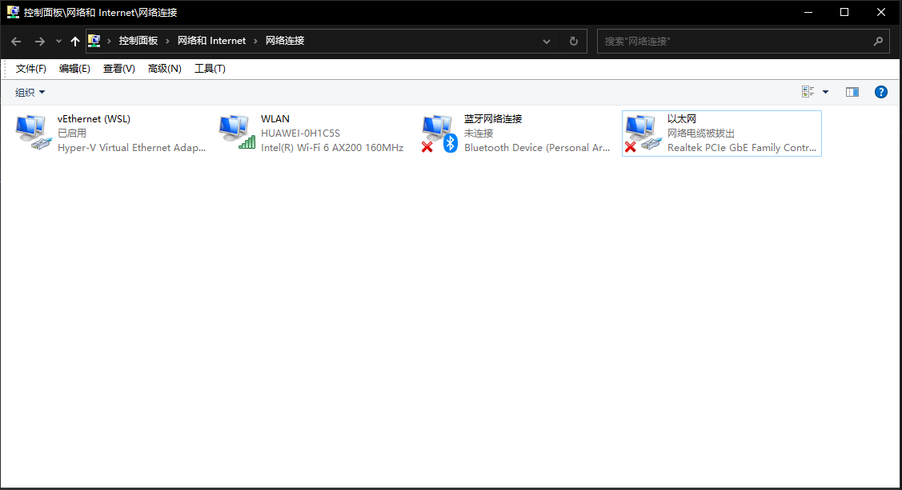
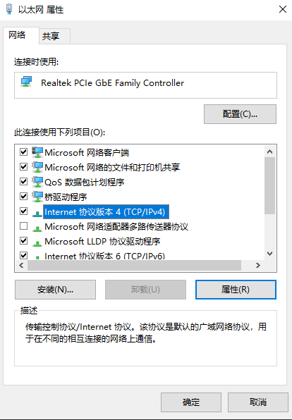
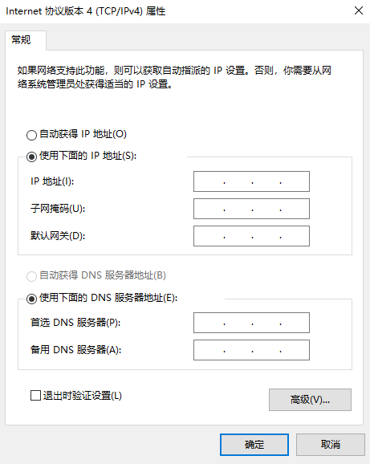

# 傲博Aubo机器人网络连接

由于我们需要使用一台安装了HYpick的上位机发送抓取点坐标及三维位姿给机械臂，而且时使用TCP协议发送的。
故需使用一条RJ45线来连接上位机和机械臂的控制器。

而这需要在上位机和机械臂示教器上分别进行设置。

## 上位机的网络设置（win10系统）

首先在`网络设置` $\rArr$ `以太网` $\rArr$ `更改适配器设置`

这样就打开了网络适配器界面，如下图：

可以看到以太网那里是断开的，因为还没有把线连上

右击以太网，点击属性，再点击ipv4，设置里手动设置ip地址。

子网掩码为空即可

默认网关这个设置得根据ip地址来，例如

ip地址：192.168.100.10（192.168.a.b）

则网关一般可设置为：192.168.100.1（192.168.a.1）

下面的DNS默认为空即可，不用管。

确定即可。

## 示教器设置

登录进机械臂控制系统后，点击设置$\rArr$系统$\rArr$网络。

在上面设置机械臂的IP地址，注意要在同一个网段，即IP地址的前三个数字必须保持相同。

设置完成后点击保存，然后重启示教器系统。

然后连上上位机，在下方输入上位机的ip地址看看能不能ping通。
