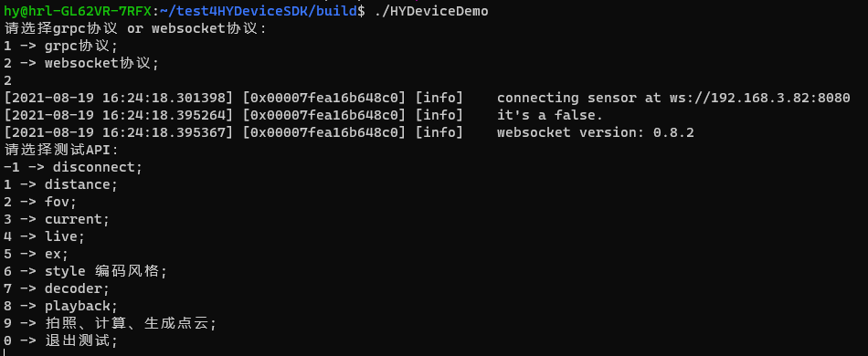
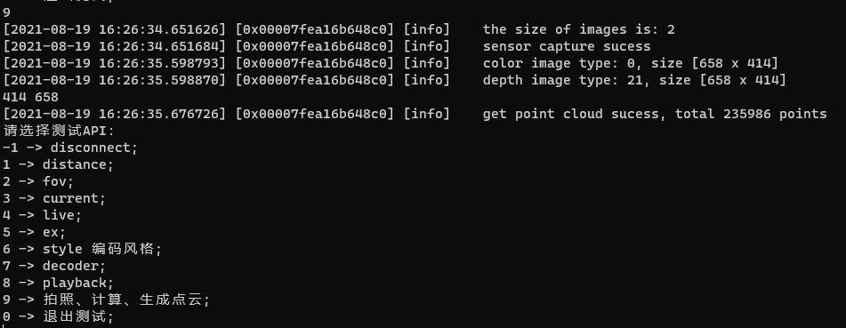
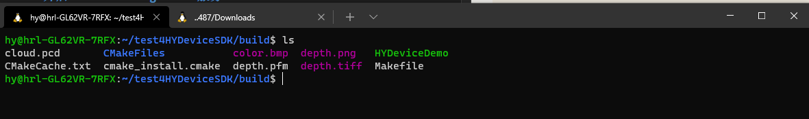

# 如何使用Linux上的HYDeviceSDK获取深度图

**注意**：
新版的HYpick里的HYDeviceManager用不了，暂时不知为何

## 使用流程

### 1、在HYpick里设置好参数

先在连接相机的win电脑上用HYpick把roi、fov等相机参数设置好

### 2、开启HYDeviceManager.exe服务

关闭HYpick，打开HYpick安装目录下的HYDeviceManager.exe

打开相机、设置通信协议为websocket、开始服务

### 3、远程连接Linux系统的测试电脑

在Linux的电脑（强烈建议使用win10提供的WSL），用ssh连接测试用的Ubuntu电脑

用户名：hy
密码：Xianyang2021

输入命令：
```bash
cd test4HYDeviceSDK/build
./HYDeviceDemo
```

即可运行程序，跟着提示走可生成点云，如图：



先输入2，选择websocket协议
然后输入9即可直接生成深度图，并将其和灰度图、点云一起保存在build目录





color.bmp:
保存的灰度图

depth.png:
可以直接打开看的深度图，但无法进行处理

depth.pfm:
无法打开，但可以进行处理的深度图

### 4、如何将图片下载到本地

使用scp命令.

在自己的Linux或者win10电脑上的WSL里输入命令：

```bash
scp -r hy@192.168.3.152:/test4HYDeviceSDK/build [你要将图片保存到的地方]
```

这样就可以将整个build文件夹下载下来了。
