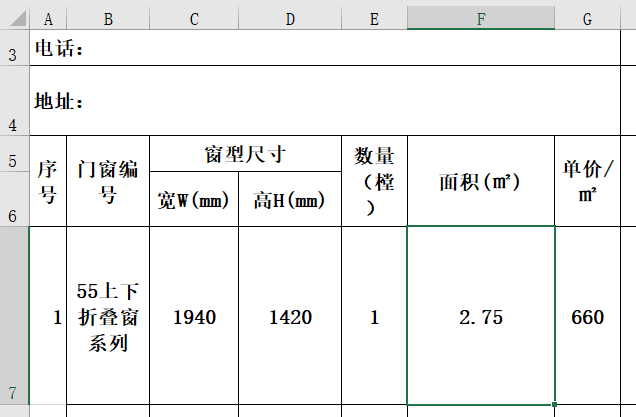
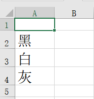
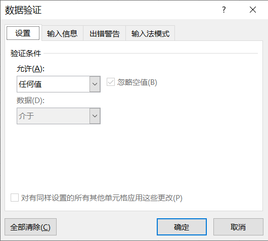
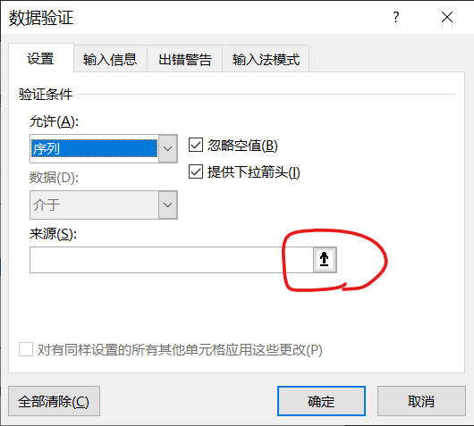
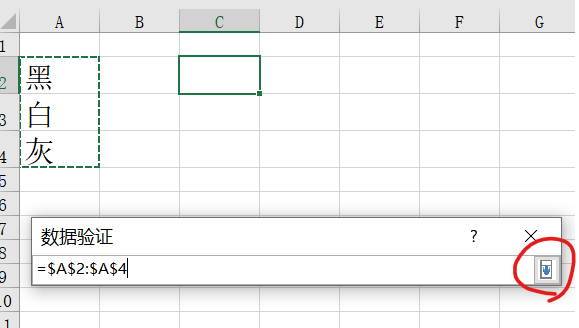
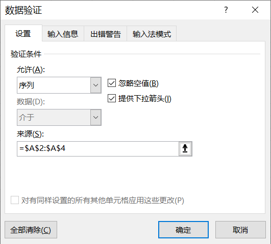
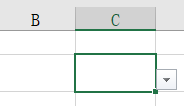

# 2022-09-14 林同学学习笔记

## 当一个公式计算的结果小于某个数时就要等于一个定值，这个公式该怎么写？

黄老师答：可以考虑使用`IF()`函数来处理这个公式

以下面这个面积计算公式为例：



$$面积 = 宽 \times 高$$

但是当面积小于$2 (m^2)$ 时，就当$2$来计算，超过就是多少就是多少。

那么Excel里F7格的公式可以这么写：

```vb
=IF(C7 * D7 / 1000000 < 2, 2, C7 * D7 / 1000000)
```

这个公式的解释：
当C7 * D7 / 1000000的结果小于2，公式的结果就是2，不小于2就是C7 * D7 / 1000000的计算结果

另外`IF()`的用法：

```vb
IF(逻辑表达式，A, B)
```

先判断逻辑表达式的结果是否为真，为真最终结果就是A处的值，否则就是B处的值

## 如何设置某个单元格的输入是可以从下拉列表里选的呢？

黄老师答：
以颜色为例子：

先在Excel空白的地方输入所有的选项（一般是新建一个sheet里写）：



这样我们就有了黑白灰三种颜色，然后点击我们要设置的单元格，然后选择：


选择上图中的“数据验证”（不同版本的office可能按钮位置名称不一样，可百度）

然后就会弹出这样的窗口：



点击任何值那里的下拉菜单


选择序列：



然后再点击上图中红圈的按钮，然后返回到Excel表中，选中我们之前写的“黑白灰”三种颜色所在的单元格：



点击上图中红圈的按钮。



最后点击确定即可。

看一下单元格旁边是不是多了一个小三角？就像这样：



如果是那就大功告成啦。

### 参考资料

https://jingyan.baidu.com/article/59703552d1f9968fc1074042.html

或者直接百度“excel表下拉选项”
