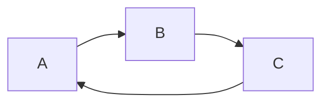
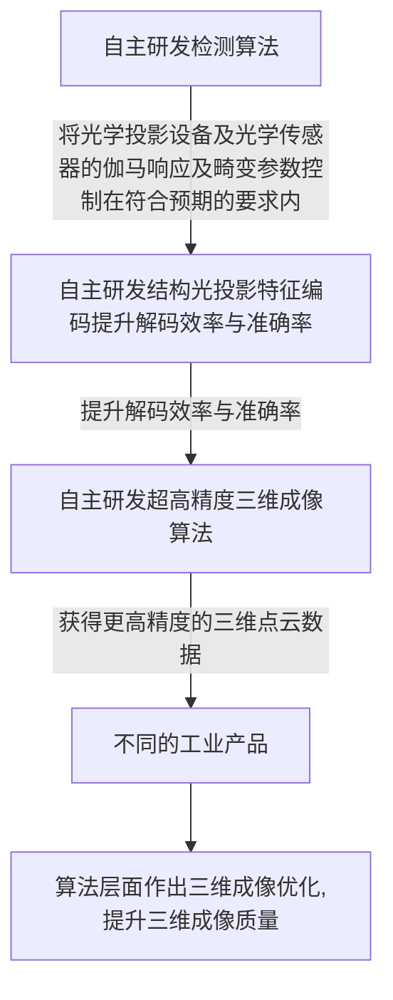
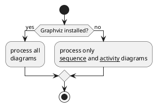
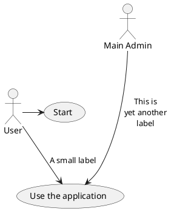

# 流程图

## Flow chart

```flow
st=>start: Start:>http://www.google.com[blank]
e=>end:>http://www.google.com
op1=>operation: My Operation
sub1=>subroutine: My Subroutine
cond=>condition: Yes
or No?:>http://www.google.com
io=>inputoutput: catch something...
para=>parallel: parallel tasks

st->op1->cond
cond(yes)->io->e
cond(no)->para
para(path1, bottom)->sub1(right)->op1
para(path2, top)->op1
```

在算法方面，本项目自主研发超高精度三维成像算法，此算法主要基于结构光三维成像技术。结构光三维成像技术是基于光学三角测量原理。使用光学投射器将一定模式的结构光透射于物体表面，在表面上形成由被测物体表面形状所调制的栅格三维图像。该三维图像由处于另一位置的摄像机探测，从而获得栅格二维畸变图像。通过对栅格二维畸变图像的解码便可重现物体表面的三维图形轮廓。为了获取更高的成像精度，本项目提出以下研发方案： 
a) 自主研发检测算法，将光学投影设备及光学传感器的伽马响应及畸变参数控制在符合预期的要求内； 
b) 自主研发结构光投影特征编码，提升解码效率与准确率； 
c) 自主研发超高精度三维成像算法，获得更高精度的三维点云数据； 
d) 针对不同的工业产品，在算法层面作出三维成像优化，提升三维成像质量。 

```flow
st=>start: Start:>http://www.google.com[blank]
e=>end:>http://www.google.com

op1=>operation: 相机拍照

cond=>condition: Yes
or No?:>http://www.google.com

para1=>parallel: algorithm tasks 1
para2=>parallel: algorithm tasks 2

para3=>parallel: robot tasks 1
para4=>parallel: robot tasks 2

st->op1->cond

cond(yes)->para1
cond(yes)->para2
cond(no)->e

para1(path1, bottom)->para3->e
para2(path1, bottom)->para4->e

para1(path2, top)->e
```

## Sequence Diagrams

```sequence {theme="hand"}
Andrew->China: Says Hello
Note right of China: China thinks\nabout it
China-->Andrew: How are you?
Andrew->>China: I am good thanks!
```

https://bramp.github.io/js-sequence-diagrams/

## Mermaid



在算法方面，本项目自主研发超高精度三维成像算法，此算法主要基于结构光三维成像技术。结构光三维成像技术是基于光学三角测量原理。使用光学投射器将一定模式的结构光透射于物体表面，在表面上形成由被测物体表面形状所调制的栅格三维图像。该三维图像由处于另一位置的摄像机探测，从而获得栅格二维畸变图像。通过对栅格二维畸变图像的解码便可重现物体表面的三维图形轮廓。为了获取更高的成像精度，本项目提出以下研发方案： 
a) 自主研发检测算法，将光学投影设备及光学传感器的伽马响应及畸变参数控制在符合预期的要求内； 
b) 自主研发结构光投影特征编码，提升解码效率与准确率； 
c) 自主研发超高精度三维成像算法，获得更高精度的三维点云数据； 
d) 针对不同的工业产品，在算法层面作出三维成像优化，提升三维成像质量。 



## Plant UML

这玩意需要安装`Java`， 我对此表示震惊





## WaveDrom

```wavedrom
{ assign:[
  ["g0", ["^", "b0", "b1"]],
  ["g1", ["^", "b1", "b2"]],
  ["g2", ["^", "b2", "b3"]],
  ["g3", ["=", "b3"]]
]}
```
