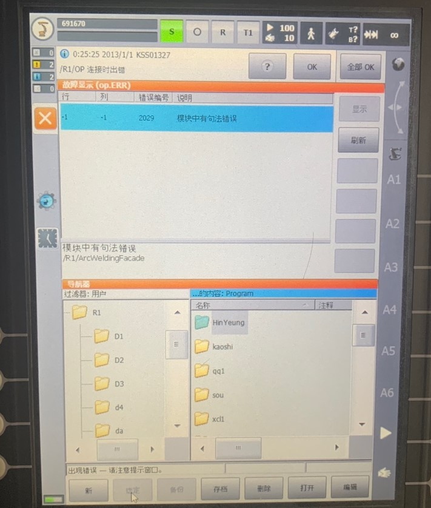

# Kuka机器人的使用中遇到的问题和错误

## 奇怪的语法错误

如图：


这里显示有句法错误的行号和列号都是负数，说明不是这个当前选定的程序有问题，而是其它程序有问题。

中间那里的提示说是`/R1/ArcWeldingFacade`模块有问题

**注意**：
报错的模块路径为`/R1/ArcWeldingFacade`，不是说模块在/R1目录下，而是在/R1及其子目录下。
故在寻找错误模块的时候不应该只在R1里面找，还要去R1的子目录下找。
使用WorkVisual软件来找会方便一点。

解决方法：
1. 如果该程序没有被使用、被引用（WorkVisual里会有提示），那么直接删除此程序即可
2. 打开出错的模块程序，改正里面的语法错误。

## WAIT FOR停下问题

### 用户权限问题？

可能需要`专家权限`

### 考虑使用替代代码

1、
```bash
;考虑使用如下代码替换
WHILE $OUT[14]==FALSE
   WAIT SEC 0.1
ENDWHILE
```
不行，不是WHILE就是WAIT那里停住。

2、
```bash
;WAIT FOR $OUT[14]==TRUE 
WHILE $OUT[14]==FALSE
   IF $OUT[14] == TRUE THEN
      EXIT
   ENDIF 
ENDWHILE
```
不行，不是WHILE就是IF那里停住。

3、
```bash
CONTINUE
WAIT FOR $OUT[14]==TRUE 
    
$OUT[14]=FALSE
```

4、
```bash
CONTINUE
WAIT FOR $OUT[14]==TRUE 
    
$OUT[14]=FALSE
```

5、
```bash
……
CONTINUE
$OUT[14]==TRUE 

RET=EKI_Init("CONNECT")
RET=EKI_Open("CONNECT")

$OUT[14]=FALSE

LOOP

CONTINUE
WAIT FOR $OUT[14]==TRUE 
    
$OUT[14]=FALSE
……
```

6、
```bash
&ACCESS RVP
&REL 3
&PARAM DISKPATH = KRC:\R1\Program
DEF SERVER()

RET=EKI_Init("CONNECT")
RET=EKI_Open("CONNECT")

LOOP

WHILE $OUT[14] == TRUE
        $OUT[14]=FALSE

        $TOOL = tool_data[4]
        $LOAD = load_data[4]
        $BASE = base_data[4]

        RET=EKI_GetBool("CONNECT","Robot/readRobotStatus",READROBOTSTATUS)

        IF READROBOTSTATUS==TRUE THEN
            RET=EKI_SetReal("CONNECT","Robot/Pos/X",$POS_ACT.X)
            RET=EKI_SetReal("CONNECT","Robot/Pos/Y",$POS_ACT.Y)
            RET=EKI_SetReal("CONNECT","Robot/Pos/Z",$POS_ACT.Z)
            RET=EKI_SetReal("CONNECT","Robot/Pos/A",$POS_ACT.A)
            RET=EKI_SetReal("CONNECT","Robot/Pos/B",$POS_ACT.B)
            RET=EKI_SetReal("CONNECT","Robot/Pos/C",$POS_ACT.C)
            RET=EKI_SetBool("CONNECT","Robot/chuck",$OUT[2])
            RET=EKI_SetBool("CONNECT","Robot/ready",$OUT[1])
            RET=EKI_Send("CONNECT","Robot")
        ELSE
            RET=EKI_GetBool("CONNECT","Robot/onlySetIO",ONLYSETIO)
            IF ONLYSETIO==TRUE THEN
                RET=EKI_GetBool("CONNECT","Robot/chuck",$OUT[2])
                RET=EKI_Send("CONNECT","Robot")
            ELSE
                RET=EKI_GetReal("CONNECT","Robot/Pos/X",POS_FR.X)
                RET=EKI_GetReal("CONNECT","Robot/Pos/Y",POS_FR.Y)
                RET=EKI_GetReal("CONNECT","Robot/Pos/Z",POS_FR.Z)
                RET=EKI_GetReal("CONNECT","Robot/Pos/A",POS_FR.A)
                RET=EKI_GetReal("CONNECT","Robot/Pos/B",POS_FR.B)
                RET=EKI_GetReal("CONNECT","Robot/Pos/C",POS_FR.C)
                LIN POS_FR
                RET=EKI_Send("CONNECT","Robot")
            ENDIF
        ENDIF
    ENDWHILE

ENDLOOP

RET=EKI_Close("CONNECT")
RET=EKI_Clear("CONNECT")
END
```
也是不行

7、
```bash
REPEAT
  R=1
  FOR R = 1 TO 100

  ENDFOR
UNTIL R>100
```

```bash
;wait for receiving data
CONTINUE
WAIT FOR $OUT[14] 
CONTINUE
$OUT[14]=FALSE
```
不行

### 考虑安装低版本的EthernetKRL 2.2.3

不行，低版本高版本运行起来还是一样

### 代码有问题？

运行报红是有错误？

尝试运行了一下新建的程序（模块），也是运行爆红。
新建的程序如下：
```bash
&ACCESS RV
&PARAM EDITMASK = *
&PARAM TEMPLATE = C:\KRC\Roboter\Template\vorgabe
DEF op( )
;FOLD INI;%{PE}
  ;FOLD BASISTECH INI
    GLOBAL INTERRUPT DECL 3 WHEN $STOPMESS==TRUE DO IR_STOPM ( )
    INTERRUPT ON 3 
    BAS (#INITMOV,0 )
  ;ENDFOLD (BASISTECH INI)
  ;FOLD USER INI
    ;Make your modifications here

  ;ENDFOLD (USER INI)
;ENDFOLD (INI)

;FOLD PTP HOME  Vel= 100 % DEFAULT;%{PE}%MKUKATPBASIS,%CMOVE,%VPTP,%P 1:PTP, 2:HOME, 3:, 5:100, 7:DEFAULT
$BWDSTART = FALSE
PDAT_ACT=PDEFAULT
FDAT_ACT=FHOME
BAS (#PTP_PARAMS,100 )
$H_POS=XHOME
PTP  XHOME
;ENDFOLD

;FOLD PTP HOME  Vel= 100 % DEFAULT;%{PE}%MKUKATPBASIS,%CMOVE,%VPTP,%P 1:PTP, 2:HOME, 3:, 5:100, 7:DEFAULT
$BWDSTART = FALSE
PDAT_ACT=PDEFAULT
FDAT_ACT=FHOME
BAS (#PTP_PARAMS,100 )
$H_POS=XHOME
PTP  XHOME
;ENDFOLD

END
```

运行到第一个折叠夹就报红，这正常吗？

这是正常的，但是wait for报红不正常啊

因为这里报红是因为机器人当前坐标和$HOME里定义的不一样，所以要先运行到那个位置才行。

### 寻找解决方案

还没找到解决的办法，可能需要上外网再问问。

When the program reaches "WAIT FOR", the robot stops. And the "START" button must be pressed to continue running.
What do I need to do to prevent the robot from stopping when the program reaches "WAIT FOR"?

A strange error about the WAIT FOR statement in KUKA Robot Language(KRL)

When the program reaches "WAIT FOR", the robot stops. And the "START" button must be pressed to continue running.
What do I need to do to prevent the robot from stopping when the program reaches "WAIT FOR"?
And I use EthernetKRL package, the source files as follow:

connect.xml:
```xml
<ETHERNETKRL>
  <CONFIGURATION>
    <EXTERNAL>
      <IP>172.31.55.5</IP>
      <PORT>60000</PORT>
      <TYPE>Client</TYPE>
    </EXTERNAL>
    <INTERNAL>
      <ENVIRONMENT>Program</ENVIRONMENT>
      <BUFFERING Mode="FIFO" Limit="10"/>
      <BUFFSIZE Limit="16384"/>
      <IP>172.31.55.6</IP>
      <PORT>54601</PORT>
      <PROTOCOL>TCP</PROTOCOL>
      <MESSAGES Logging="error" Display="disabled"/>
    </INTERNAL>
  </CONFIGURATION>
  <RECEIVE>
    <XML>
      <ELEMENT Tag="Robot/Pos/X" Type="REAL" />
      <ELEMENT Tag="Robot/Pos/Y" Type="REAL" />
      <ELEMENT Tag="Robot/Pos/Z" Type="REAL" />
      <ELEMENT Tag="Robot/Pos/A" Type="REAL" />
      <ELEMENT Tag="Robot/Pos/B" Type="REAL" />
      <ELEMENT Tag="Robot/Pos/C" Type="REAL" />
      <ELEMENT Tag="Robot/ready" Type="BOOL" />
      <ELEMENT Tag="Robot/chuck" Type="BOOL" />
      <ELEMENT Tag="Robot/readRobotStatus" Type="BOOL" Set_Out="14"/>
      <ELEMENT Tag="Robot/onlySetIO" Type="BOOL" Set_Out="15"/>
      <ELEMENT Tag="Robot" Set_Flag="14" />
    </XML>
  </RECEIVE>
  <SEND>
    <XML>
      <ELEMENT Tag="Robot/Pos/X" />
      <ELEMENT Tag="Robot/Pos/Y" />
      <ELEMENT Tag="Robot/Pos/Z" />
      <ELEMENT Tag="Robot/Pos/A" />
      <ELEMENT Tag="Robot/Pos/B" />
      <ELEMENT Tag="Robot/Pos/C" />
      <ELEMENT Tag="Robot/ready" />
      <ELEMENT Tag="Robot/chuck" />
      <ELEMENT Tag="Robot/readRobotStatus" />
      <ELEMENT Tag="Robot/onlySetIO" />
    </XML>
  </SEND>
</ETHERNETKRL>
```

server.src:
```
&ACCESS RVP
&REL 3
&PARAM DISKPATH = KRC:\R1\Program
DEF SERVER()

RET=EKI_Init("CONNECT")
RET=EKI_Open("CONNECT")

LOOP

WAIT FOR $OUT[14]==TRUE 
    
$OUT[14]=FALSE

$TOOL = tool_data[4]
$LOAD = load_data[4]
$BASE = base_data[4]

RET=EKI_GetBool("CONNECT","Robot/readRobotStatus",READROBOTSTATUS)

IF READROBOTSTATUS==TRUE THEN
RET=EKI_SetReal("CONNECT","Robot/Pos/X",$POS_ACT.X)
RET=EKI_SetReal("CONNECT","Robot/Pos/Y",$POS_ACT.Y)
RET=EKI_SetReal("CONNECT","Robot/Pos/Z",$POS_ACT.Z)
RET=EKI_SetReal("CONNECT","Robot/Pos/A",$POS_ACT.A)
RET=EKI_SetReal("CONNECT","Robot/Pos/B",$POS_ACT.B)
RET=EKI_SetReal("CONNECT","Robot/Pos/C",$POS_ACT.C)
RET=EKI_SetBool("CONNECT","Robot/chuck",$OUT[2])
RET=EKI_SetBool("CONNECT","Robot/ready",$OUT[1])
RET=EKI_Send("CONNECT","Robot")

ELSE
RET=EKI_GetBool("CONNECT","Robot/onlySetIO",ONLYSETIO)

IF ONLYSETIO==TRUE THEN
RET=EKI_GetBool("CONNECT","Robot/chuck",$OUT[2])
RET=EKI_Send("CONNECT","Robot")

ELSE
RET=EKI_GetReal("CONNECT","Robot/Pos/X",POS_FR.X)
RET=EKI_GetReal("CONNECT","Robot/Pos/Y",POS_FR.Y)
RET=EKI_GetReal("CONNECT","Robot/Pos/Z",POS_FR.Z)
RET=EKI_GetReal("CONNECT","Robot/Pos/A",POS_FR.A)
RET=EKI_GetReal("CONNECT","Robot/Pos/B",POS_FR.B)
RET=EKI_GetReal("CONNECT","Robot/Pos/C",POS_FR.C)

LIN POS_FR


RET=EKI_Send("CONNECT","Robot")
ENDIF

ENDIF

ENDLOOP

RET=EKI_Close("CONNECT")
RET=EKI_Clear("CONNECT")
END
```

server.dat:
```
&ACCESS RVP
&REL 3
&PARAM DISKPATH = KRC:\R1\Program
DEFDAT  server PUBLIC
DECL EKI_STATUS RET
DECL BOOL READROBOTSTATUS=TRUE
DECL BOOL ONLYSETIO=FALSE
;DECL REAL POS_X=100
;DECL REAL POS_Y=100
;DECL REAL POS_Z=100
;DECL REAL POS_A=100
;DECL REAL POS_B=100
;DECL REAL POS_C=100
DECL FRAME POS_FR={X 100.000,Y 100.000,Z 50.0000,A 0.0,B 50.0000,C 30.0000}
DECL BASIS_SUGG_T LAST_BASIS={POINT1[] "P0",POINT2[] "P0",CP_PARAMS[] "CPDAT0",PTP_PARAMS[] "PDAT0",CONT[] " ",CP_VEL[] "2.0",PTP_VEL[] " 100",SYNC_PARAMS[] "SYNCDAT",SPL_NAME[] "S0",A_PARAMS[] "ADAT0"}

DECL INT cnt

ENDDAT
```

My purpose is to use a computer as the client and I want the robot as the server. When the computer sends data to the robot, $FLAG[15]=TRUE, and then the robot will return data to the computer.
If anyone can help me, I would be very grateful.

@Micahstuh：
Does it wait at that line for a long time during this process, or does it immediately put the robot out of run mode when it hits the WAIT FOR statement? I am thinking what's stopping your robot might actually be in the submit interpreter or an interrupt somewhere. Also, Welcome to StackOverflow John! 

Thank you.
First, the variable $OUT[14] is FALSE before I put the program in the run mode. Then I choose the program and start to run it.
When it hits the WAIT FOR statement, it will not put robot out of run  mode and will wait for $OUT[14]==TRUE until I set $OUT[14]=TRUE, but it tells me I need to press the start button after I set $OUT[14]=TRUE.
I don't know whether this situation is normal?

Can you tell me how to make the robot wait for a signal(such as $OUT[14]) and then start again without pressing the start button.
