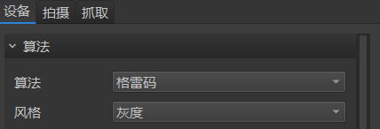
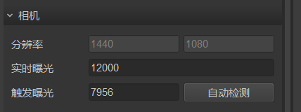
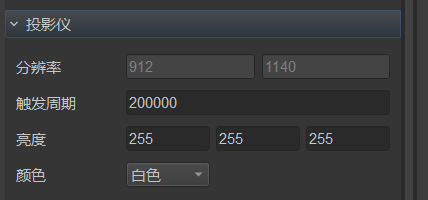
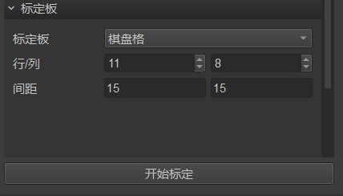
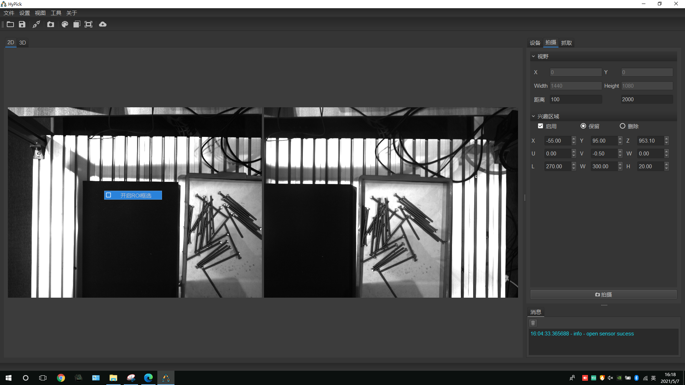
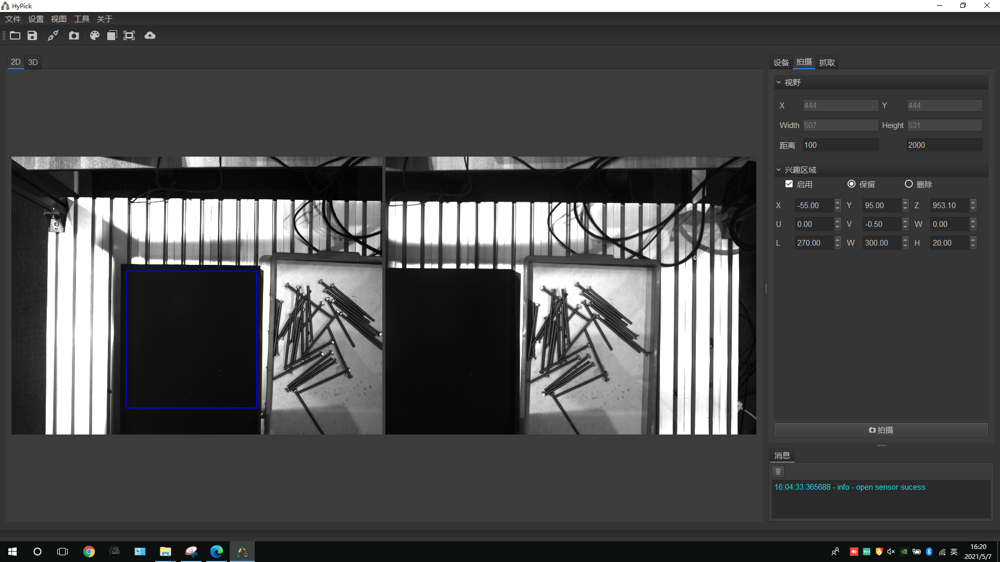
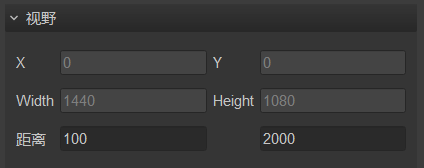

# 机器人与机器视觉入门

[toc]

## 相机与镜头的选型

## 光源选型


## HYpick

### 设备要求

笔记本或者台式电脑需要有1个以太网RJ-45接口和3个USB接口（其中**至少2个是USB3.0接口**）。

如果没有以太网的RJ-45接口可以使用转接线，没有影响。
如果USB接口不够可以使用扩展线，但是要注意传输带宽的问题，该问题可能会导致识别拍照失败。

### 软件

MVS、HYpick 2.7.1.7

## 硬件调试

### 相机的连接

将视觉设备的三条USB线连接到电脑上。
用MVS软件打开摄像头看看是不是所有的摄像头都能够连得上，能否正常采集相片。

## 软件（HYpick）的基本使用

所有的摄像头都可以正常采集相片后就可以在HYpick里连接相机进行后续工作了。


点击从左数第三个按键连接相机。


### 算法

点击右边的```设备```，算法编码默认选择格雷码，风格默认为灰度



### 相机曝光参数的设置

每一次打开HYpick后，在拍摄照片以及生成点云前都要先检查曝光参数的设置是否正确。虽然最新版本的HYpick会自动记录你上一次使用设置的参数，但有时候拍摄环境发生变化需要重新设置曝光参数。



#### 分辨率

受限于相机自身，是固定的，不用设置

#### 实时曝光

根据现场的光照情况进行设置，欠曝光或者过曝光都会影响到后续的立体标定和点云生成。

#### 触发曝光

最新的HYpick有自动检测功能，这个自动检测功能是根据你设置的实时曝光来检测的。如果检测出来后点云生成质量不好，则说明实时曝光的设置不合理。

### 投影仪参数的设置



#### 分辨率

受限于投影仪自身，是固定的，不用设置

#### 触发周期

设置的值过大会导致拍照识别的速度过慢，过小则可能会导致无法在周期内完成拍摄导致识别失败。

#### 投影仪的亮度

RGB三通道，范围$[0 , 255]$，根据环境光的情况来设置。亮度不足会导致生成的点云质量不佳，无法识别。

### 立体标定

在设置好相机的参数后就可以开始立体标定了。

#### 标定板的选择以及优缺点

目前主流的有棋盘标定板、对称圆点标定板、非对称圆点标定板等。

#### 标定板的放置以及参数设置

这里以棋盘格标定板为例。在开始标定前先要确保标定板上没有明显的划痕。
将标定板放在左相机视野里的靠近中间的区域，且保证右相机能够看到标定板上所有的角点。

在HYpick里的左右相机窗口放大观察棋盘上每一个格子的边缘，边缘应是锯齿状的。

开始标定之前要设置标定板的参数，棋盘格子的行数和列数必须是一个奇数和一个偶数。



#### 开始标定

点击```开始标定```按钮即可开始标定。

每一次取图后都要移动标定板使其在水平位移、选择、倾斜的角度也要有变化（拿个东西将标定板的一侧垫高）。

### 生成点云

在完成立体标定后就可以生成点云了，点击按钮：


从左数第四个按钮或者快捷键Ctrl + 1即可拍摄生成点云。

#### 过滤无关点云的干扰

为了以后识别更准确不受无关点云的干扰，我们需要对点云进行过滤。

首先是在2D界面框选ROI区域：



鼠标右击图像勾选```开启ROI框选```，之后就可以用鼠标框选ROI区域过滤其它地方了。



视野里的距离设置：根据要拍摄的物体到相机的距离来设置最小值和最大值，一般设置最小值为100，最大值为2000足矣。



然后是在3D界面设置xyz等参数划定兴趣区域：


使得被识别的物体在黄色框内，即可过滤其它无关点云。

### 将机器人连接到电脑

HYpick连接机器人是为了做后面的手眼标定以及在抓取的过程中电脑将识别到的抓取点的坐标发送给机器人。

以勃朗特机器人为例：
将网线一端连到机器人控制器的monitor接口，另一端接到笔记本电脑的RJ-45以太网接口。

在Windows系统电脑上打开网络设置，手动设置电脑的IP地址和DNS。

在示教器里的“参数设置”->“通讯设置”，设置机器人的IP地址，输入电脑的IP地址，勾选主机使能、服务器模式，最后点击确定修改。

在电脑上打开cmd，用ping指令检查机器人的IP地址是否能连通。

### 手眼标定

立体标定结束后即可进行手眼标定。

将标定板安装到机器人末端的法兰盘上。然后让HYpick连接到机器人。

手眼标定要注意让控制机器人末端有较大的空间位移，如果xyzuvw的差值不够大，消息界面会有提示信息，据此调整即可。
另外，标定板到相机的距离最好是在抓取平面到相机距离的中点附近。

控制机器人末端到位后，点击取图即可。

取图数量达到15张点击标定即可标定。

如果弹出标定失败的窗口，则需要查看HYpick根目录下的日志log文件，看看有多少幅图的精度超限被舍弃了，再接着取图，直到有15幅图的精度满足要求即可。（精度要求为小于0.15）

### 工具标定

#### 两点法

将机器人末端调整到u约等于180，v约等于0，w任意即可进行工具标定。

新建工具、命名
点击末端设入，测量夹具的长度length，在z那填入-length，点击修改即可。

#### 六点法

## 夹具的使用

### 电爪

以慧灵电爪为例，有两种不同的IO类型的电爪：NK和PK。
需要分别测试，看看机器人对应的IO是哪个。

### 气爪

气爪需要2个电磁阀即2个机器人控制器的IO。

使用前要打开气泵。

## 勃朗特机器人的使用

### 使用示教器直接控制机器人

示教器，手动模式。

### 编程控制机器人

示教器，手动模式，编程

自动模式，启动

### IO的使用

首先要知道电路板上的X和Y是可以自定义用的，但是X是输入（暂时用不了），Y是输出。

经过摸索可以得出IO表对应的代码：

|IO名|代码|
|:--:|:--:|
|Y010~Y017|0~7|
|Y020~Y027|8~15|
|Y030~Y037|16~23|
|Y040~Y047|24~31|

不确定控制器上的气爪IO是Y？，只知道代码是21和22.
其它的可以自己摸索。

目前的IO是3控制拍照，8控制机器人是否行动。

## 无序抓取

在进行抓取之前，确保立体标定、手眼标定、工具标定已完成，点云生成的质量较好，检查夹具是否正常工作，HYpick是否能够与机器人建立连接。

### 被抓取物体的模板制作

先生成目标物的点云模型。


点击从左数第二个按钮可将生成的点云保存为pcd文件。

新建模板、选择模型、设置算法参数。

### 识别测试

选取好模板后，可以测试一下，看看识别的效果。

### 运行抓取的流程

以勃朗特机器人为例，现在示教器上调到自动模式，然后点击HYpick抓取的界面的运行，再按下示教器的启动按钮。

### 补偿值的调整

每一次更换夹具后要重新调整。
