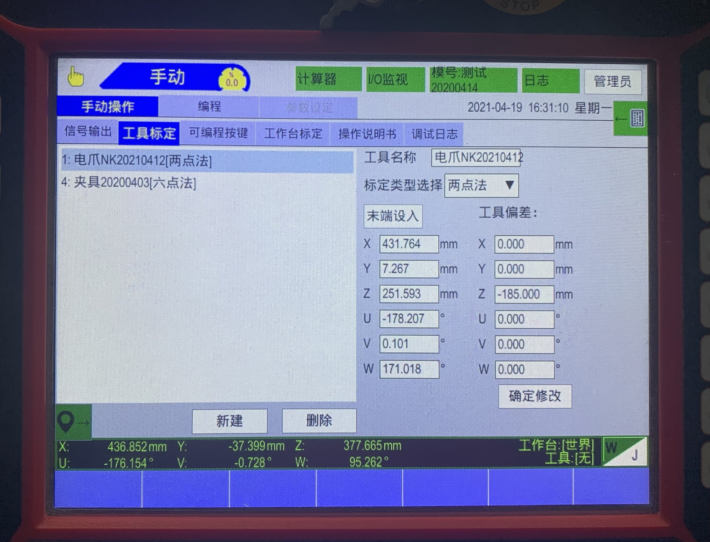
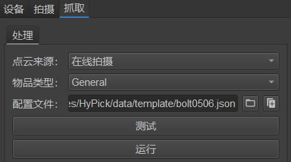

# 机器人与机器视觉入门

[toc]

## 工业视觉成像系统选型

工业视觉成像系统主要由工业镜头和工业相机组成的。
镜头的作用是将物体反射的光线聚到成像平面从而形成清晰的影像。
相机则是将镜头形成的影像通过传感器转换为数字信号并存储为数字图像以便进行后续处理。

### 镜头选型

镜头主要由一组光学透镜组成，可分为定焦镜头和变焦镜头两类。工业镜头主要是定焦镜头，虽然焦距固定，但可通过调整镜片与相机成像靶面的距离来改变像距从而让不同距离的物体在相机中形成清晰的影像。这个操作一般称之为“对焦”。

镜头上一般会标有三个参数：焦距、最大光圈、靶面尺寸。

**焦距**：

焦距($f$)是镜头光心到焦点的距离，焦距的大小和视野成反比。

市场上工业镜头焦距一般是$12mm, 16mm, 20mm, 25mm, 35mm, 50mm, 75mm$。

**最大光圈**：
是焦距和光圈最大孔径的比值。
例如：一个镜头的焦距是$12mm$，最大光圈是$1:1.4$，则其光圈最大孔径为：$$\frac{1}{1.4} = \frac{f}{光圈最大孔径}$$
$$最大孔径 = \frac{f}{1.4}$$

**靶面尺寸**：
镜头与相机连接处的镜片的尺寸。

常见的靶面尺寸有：

|尺寸（英寸）|靶面宽（mm）|靶面高（mm）|
|--|--|--|
|1.1|12|12|
|1|12.8|9.6|
|$\dfrac{2}{3}$|8.8|6.6|
|$\dfrac{1}{1.8}$|7.2|5.4|
|$\dfrac{1}{2}$|6.4|4.8|
|$\dfrac{1}{3}$|4.8|3.6|
|$\dfrac{1}{4}$|3.2|2.4|
|$\dfrac{1}{6}$|2.4|1.8|

### 相机选型

工业相机的本质功能就是将光信号转换为有序的电信号，按照芯片类型的不同，可分为CCD相机和CMOS相机。
CCD相机比CMOS相机有更好的色彩还原度和清晰度，但成本也更高。
另外根据不同的信号传输速度，相机拥有不同类型的数据接口，如Gige、Camera Link和USB 3.0等。

相机的主要参数有像元尺寸、分辨率和靶面尺寸。

**像元尺寸**：
是相机芯片上的每个像元的实际物理尺寸，目前工业相机的像元尺寸一般为$2.2\mu m$到$10\mu m$

**分辨率**
由相机所采用的芯片决定，即芯片靶面排列的像元数量。通常用水平和垂直分辨率两个数字一起表示，例如：$1920(R_H) \times 1080(R_V)$

**靶面尺寸**

传感器的感光部分的大小，像元尺寸和分辨率共同决定了相机靶面尺寸的大小。需要与镜头的靶面尺寸相配。

有的说法称之为“感应尺寸”。

### 选型思路

实际应用中，需要综合考虑视野（FOV）大小、物距（又称之为工作距离）和成像精度等因素选择合适的相机和镜头。

设物距为$d$、镜头焦距$f$、相机分辨率$R_h \times R_v$、相机靶面尺寸$S_h \times S_n$、视野大小$F_h \times F_v$，成像精度$P_h \times P_v$，有以下基本换算关系

$$
\left\{  
  \begin{array}{lr}  
  F_h = \dfrac{d \cdot S_h}{f} & \\  
  F_v = \dfrac{d \cdot S_v}{f} & \\      
  \end{array}  
\right.  
$$

$$
\left\{  
  \begin{array}{lr}  
  P_h = \dfrac{d \cdot S_h}{f \cdot R_h} = \dfrac{F_h}{R_h}\\  
  P_v = \dfrac{d \cdot S_v}{f \cdot R_v} = \dfrac{F_v}{R_v}\\      
  \end{array}  
\right.  
$$

根据已知的相机靶面尺寸($S_h \times S_n$)、视野大小($F_h \times F_v$)和物距($d$)计算出工业镜头的焦距($f$)，从而选出合适的镜头。
其计算公式为：

$$f_1 ＝ d \times \dfrac{S_h}{F_h}$$
或者
$$f_2 ＝ d \times \dfrac{S_v}{F_v}$$

如果$f_1 \neq f_2$，那么$f = \min\{f_1, f_2\}$。
即如果靶面尺寸长宽不同，则选上述两个式子算出的焦距的较小值作为选型参考。

**例如**：
假设视野是$100 \times 100mm$, 物距($d$)是$500mm$，靶面为$2/3$英寸 可以选择焦距为$35mm$的工业镜头。

$$ f = d \cdot \dfrac{S_v}{F_v} = 500 \cdot \dfrac{6.6}{100} = 35mm$$

为方便叙述，示例是在先确定一个设备参数的情况下直接确定另一个设备的参数。实际选型时往往需要同时考虑相机参数和镜头参数，只要能满足最终需求即可。

## 光源选型

首先我们需要了解，机器视觉中的光源起到哪些作用：
1. 照亮目标，提高亮度；
2. 形成有利于图像处理的成像效果，降低系统的复杂性和对图像处理算法的要求；
3. 克服环境光干扰，保证图像稳定性，提高系统的精度、效率；

通过恰当的光源照明设计，可以使图像中的目标信息与背景信息得到最佳分离，这样不仅大大降低图像处理的算法难度，同时提高系统的精度和可靠性。
遗憾的是目前没有一个通用的机器视觉照明系统，可以应对不同的检测要求，因此针对每个特定的案例，都需要设计适应的照明装置，以达到最佳效果。
不合适的照明，则会引起很多问题。

### 机器视觉照明技术基础知识

#### 1)照射方式

选择不同的光源，控制和调节照射到物体上的入射光的方向是机器视觉系统设计的最基本的参数，它取决于光源的类型和相对于物体放置的位置，一般来说有二种最基本的方式：**直射光**和**漫射光**，所有其它的方式都是从这二种方法中延伸出来的。


**直射光**：入射光基本上来自一个方向，射角小，它能投射出物体阴影；
**漫射光**：入射光来自多个方向，甚至于所有的方向，它不会投射出明显的阴影

#### 2)反射方式

物体反射光线有两种不同的反射特性：直反射和漫反射


**直反射**：光线的反射角等于入射角。直反射有时用途很大，有时又可能产生极强的眩耀。在大多数情况应避免镜面反射。
**漫反散**：照射到物体上的光从各个方向漫散出去。在大多数实际情况下，漫散光在某个角度范围内形成，并取决于入射光的角度。

#### 3)颜色

光谱中很大的一部分电磁波谱是人眼可见的，在这个波长范围内的电磁辐射被称作可见光，范围在400nm至760nm之间（有的人可以观测到380nm-780nm），即从紫色380nm到红色780nm。


色环就是在可见光光谱中的色彩进行排序，形成红色连接到另一端的紫色，机器视觉种应用到色环通常包括6种不同的颜色，分为两大类：暖色和冷色，暖色由红色调构成，冷色来自于蓝色调，通常用相反色温的光线照射，图像可以达到最高级别的对比度，相同色温的光线照射，可以有效滤除，因此灵活利用色温特性，对我们选择光源很有帮助。


#### 4)明视场和暗视场

明视场是最常用的照明方案，采用正面直射光照射形成，而暗视场主要由低角度或背光照明形成，对于不同项目检测需求，选择不同类型的照明方式，一般来说暗视场会使背景呈现黑暗，而被检物体则呈现明亮。


#### 5)光源分类

目前主要有以下集中分类方式：

##### a)颜色

常用光源颜色集中在可见光范围，主要有白光（复合光）、红色、蓝色、绿色，另外红外光也比较普及，而紫外光由于各种原因，应用较少；

##### b)外形

各厂家会根据不同光源外形特性进行分类，也是目前的主流分类，比如环形光源、环形低角度光源、条形光源、圆顶光源（碗光源/穹顶光源）、面光源等；

##### c)工作原理/特性

不同的应用方式或者原理进行分类，主要有无影光源、同轴光源、点光源、线光源、背光源、组合光源以及结构光源等。

### LED 发光二极管

目前机器视觉光源主要采用LED（发光二极管），由于其形状自由度高、使用寿命长、响应速度快、单色性好、颜色多样、综合性价比高等特点在行业内广泛应用：

#### 一、形状自由度

一个LED光源是由许多单个LED组合而成的，因而跟其他光源相比，可做成更多的形状，更容易针对用户的情况，设计光源的形状和尺寸。

#### 二、使用寿命长

为了使图像处理单元得到精确的，重复性好的测量结果，照明系统必须保证相当长的时间内能够提供稳定的图像输入。LED光源在连续工作10,000到30,000小时后，亮度衰减，但远比其他型式的光源效果好。此外，用控制系统使其间断工作，可抑制发光管发热，寿命也将延长一倍。

#### 三、响应速度快

LED发光管响应时间很短，响应时间的真正意义是能按要求保证多个光源之间或一个光源不同区域之间的工作切换，采用专用控制器给LED光源供电时，达到最大照度的时间小于10s

#### 四、颜色多样

除了光源的形状以外，得到稳定图像输入的另一方面就是选择光源的颜色。甚至相同形状的光源，由于颜色的不同得到的图像也会有很大的差别。实际上，如何利用光源颜色的技术特性得到最佳对比度的图像效果一直是光源开发的主要方向。

#### 五、综合性运营成本低

选用低廉而性能没有保证的产品，初次投资的节省很快会被日常的维护、维修费用抵消。其他光源不仅耗电是LED光源的2-10倍，而且几乎每月就要更换，浪费了维修工程师许多宝贵的时间。而且投入使用的光源越多，在器件更换和人工方面的花费就越大，因此选用寿命长的LED光源从长远看是很经济的。

### 常见的光源类型及照明方式

#### 1、直接照明

光直接射向物体，得到清楚的影像。

当我们需要得到高对比度物体图像的时候，这种类型的光很有效。但是当我们用它照在光亮或反射的材料上时，会引起像镜面的反光。通用照明一般采用环状或点状照明。环光是一种常用的通用照明方式，其很容易安装在镜头，可给漫反射表面提供足够的照明。

#### 2、暗场照明

暗场照明是相对于物体表面提供低角度照明。

亮场照明与暗场照明的区分：
使用工业相机拍摄镜子使其在其视野内，如果在视野内能看见光源就认为是亮场照明，相反的在视野中看不到光源就是暗场照明。因此光源是亮场照明还是暗场照明与光源的位置有关。
典型的暗场照明应用于对表面部分有突起的部分的照明或表面纹理变化的照明。

#### 3、背光照明

从物体背面射过来均匀视场的光，通过相机可以看到物面的侧面轮廓。

背光照明常用于测量物休的尺寸和确定物体的方向。背光照明产生了很强的对比度。应用背光技术时候，物体表面特征可能会丢失。例如，可以应用背光技术测量硬币的直径，但是却无法判断硬币的正反面。

#### 4、漫射照明

连续漫反射照明应用于物体表面的反射性或者表面有复杂的角度。

连续漫反射照明应用半球形的均匀照明，以减小影子及镜面反射。这种照明方式对于完全组装的电路板照明非常有用。这种光源可以达到170立体角范围的均匀照明。

#### 5、同轴照明

同轴光的形成－－通过垂直墙壁出来的发散光，射到一个使光向下的分光镜上，相机从上面通过分光镜看物体。

这种类型的光源对检测高反射的物体特别有帮助，还适合受周围环境产生阴影的影响，检测面积不明显的物体。

#### 6、偏振片

只允许振动方向平行于其允许方向的光能通过，垂直分量被截止。

### 选型方法

#### 1、观察试验法

**准备工作**

1. 准备好丰富的测试样品，包括不同种类的完好样品及问题样品，尽可能的让样品出现所有的问题，特别是要有最难检测实际有问题的样品。
2. 选好多款备用测试光源，LED光源常见的几大类，以及不同的颜色都要有。

**环境要求分析**

1. 从客户那里了解对系统结构及运行的要求，确定工业相机、光源、被测物的空间结构关系。确定的参数有：视场(FOV),工作距离(WD)；
2. 空间结构有: 直射，侧射，背部照射：
   
**直射结构的光源**：部分环形光源，同轴光源，圆顶光源；
**侧射结构的光源**：部分环形光源，条形光源，线光源，点光源；
**背部照射**：方形背光源，条形背光源。

**物体表面纹理及颜色分析**

1. 物体表面是曲面还是平面？物体表面是否光滑？反光是否很强？
   1. 曲面检测宜用圆顶光源，光滑平面宜用同轴光源，粗糙平面宜用明视场光源。
2. 物体的透光性怎样？
   1. 透光性好的物体可以用IR光源。
3. 分清背景(我们不需要检测的)是什么颜色，前景(我们要检测的)是什么颜色？
   1. 好的光源就是有一个好的对比度－－-背景与前景很清楚。
4. 前景颜色多变化
5. 除了白色光源外至少准备一种其它颜色的光源；

**实物测试**

我们可以初步选定一款光源开始测试。可能会遇到的问题(与光源有关)：

1、前景亮度不够？前景是什么颜色？建议换与前景颜色相同的光源测试。
2、整个图像亮度不够？建议将光源靠近物体一些，或者采用频闪，或者换波长短一些的光源。
3、图像泛白？建议降底光源亮度，或将镜头的光圈减小。
4、图像亮度不均匀？检查光源放平没有？

#### 2、科学分析法

该方法主要是根据被测物表面特性以及要检测的瑕疵特性等，从光源照射方向、角度、颜色等方面进行分析，可结合文章前面中相关的介绍，当然即使经过了分析，还是需要经过实验验证。

最后我们大致总结出，光源选型中的一些技巧，选型时可参考：
1、需要前景与背景更大的对比度?–考虑用黑白相机与彩色光源
2、环境光的问题?–尝试用单色光源，配一个滤镜
3、闪光曲面?–尝试用散射圆顶光
4、闪光，平的，但粗糙的表面?–尝试用同轴散射光
5、看表面的形状?–考虑用暗视场(低角度)
6、检测塑料的时候–尝试用紫外或红外光
7、需要通过反射的表面看特征?–尝试用低角度线光源(暗视场)
8、组合光源有时也能解决问题
9、频闪能够产生比常亮照明20倍强的光


## 相机SDK的使用

以海康威视的工业相机为例，

## HYpick的使用

### 设备要求

笔记本或者台式电脑需要有1个以太网RJ-45接口和3个USB接口（其中**至少2个是USB3.0接口**）。

如果没有以太网的RJ-45接口可以使用转接线，没有影响。
如果USB接口不够可以使用扩展线，但是要注意传输带宽的问题，该问题可能会导致识别拍照失败。

### 相机的连接

HYpick里连接相机操作：


点击从左数第三个按键连接相机。


上图是双目相机成功连接的示意图，相机如果连接失败会在右下角的消息窗口出现报错信息。

### 算法

点击右边的```设备```，算法编码默认选择格雷码，风格默认为灰度


### 相机曝光参数的设置

每一次打开HYpick后，在拍摄照片以及生成点云前都要先检查曝光参数的设置是否正确。虽然HYpick会自动记录你上一次使用设置的参数，但有时候拍摄环境发生变化需要重新设置曝光参数。


#### 分辨率

受限于相机自身，

#### 实时曝光

根据现场的光照情况进行设置，欠曝光或者过曝光都会影响到后续的立体标定和点云生成。

#### 触发曝光

可以根据测试的经验自己手动设置，也可以使用HYpick的自动检测功能，这个自动检测功能是根据你设置的实时曝光来检测的。如果检测出来后点云生成质量不好，则说明实时曝光的设置不合理。

### 投影仪参数的设置


#### 分辨率

受限于投影仪自身，是固定的值，由HYpick自动识别不用设置。

#### 触发周期

设置的值过大会导致拍照识别的速度过慢，过小则可能会导致无法在周期内完成拍摄导致识别失败。

#### 投影仪的亮度

RGB三通道，范围$[0 , 255]$，根据环境光的情况来设置。亮度不足会导致生成的点云质量不佳，无法识别。

## 立体标定

在设置好相机的参数后就可以开始立体标定了。

#### 标定板的选择以及优缺点

目前主流的有棋盘标定板、对称圆点标定板、非对称圆点标定板等。

#### 标定板的放置以及参数设置

这里以棋盘格标定板为例。在开始标定前先要确保标定板上没有明显的划痕。
将标定板放在左相机视野里的靠近中间的区域，且保证右相机能够看到标定板上所有的角点。

在HYpick里的左右相机窗口放大观察棋盘上每一个格子的边缘，边缘应是锯齿状的。

开始标定之前要设置标定板的参数，棋盘格子的行数和列数必须是一个奇数和一个偶数。


#### 开始标定

点击```开始标定```按钮即可开始标定。

每一次取图后都要移动标定板使其在水平位移、选择、倾斜的角度也要有变化（拿个东西将标定板的一侧垫高）。

### 生成点云

在完成立体标定后就可以生成点云了，点击按钮：


从左数第四个按钮或者快捷键Ctrl + 1即可拍摄生成点云。

#### 过滤无关点云的干扰

为了以后识别更准确不受无关点云的干扰，我们需要对点云进行过滤。

首先是在2D界面框选ROI区域：


鼠标右击图像勾选```开启ROI框选```，之后就可以用鼠标框选ROI区域过滤其它地方了。


视野里的距离设置：根据要拍摄的物体到相机的距离来设置最小值和最大值，一般设置最小值为100，最大值为2000足矣。


然后是在3D界面设置xyz等参数划定兴趣区域：


使得被识别的物体在黄色框内，即可过滤其它无关点云。

### 将机器人连接到电脑

HYpick连接机器人是为了做后面的手眼标定以及在抓取的过程中电脑将识别到的抓取点的坐标发送给机器人。

以勃朗特机器人为例：
将网线一端连到机器人控制器的monitor接口，另一端接到笔记本电脑的RJ-45以太网接口。

在Windows系统电脑上打开网络设置，手动设置电脑的IP地址。

在示教器里的“参数设置”->“通讯设置”，设置机器人的IP地址，输入电脑的IP地址，勾选主机使能、服务器模式，最后点击确定修改。

在电脑上打开cmd，用ping指令检查机器人的IP地址是否能连通。

## 手眼标定

立体标定结束后即可进行手眼标定。

将标定板安装到机器人末端的法兰盘上。然后让HYpick连接到机器人，连接成功后，打开HYpick的日志文件（路径：根目录-data-log），查看HYpick获取的机器人坐标与示教器上的是否一致。

手眼标定要注意让控制机器人末端有较大的空间位移，如果xyzuvw的差值不够大，消息界面会有提示信息，据此调整即可。
另外，标定板到相机的距离最好是在抓取平面到相机距离的中点附近。

控制机器人末端到位后，点击取图即可。

取图数量达到15张点击标定即可标定。

如果弹出标定失败的窗口，则需要查看HYpick根目录下的日志log文件，看看有多少幅图的精度超限被舍弃了，再接着取图，直到有15幅图的精度满足要求即可。（精度要求为小于0.15）

## 工具标定

以勃朗特机器人为例。
工具标定是在示教器里进行的。
“手动模式”->“工具标定”



#### 两点法

将机器人末端调整到u约等于180，v约等于0，w任意即可进行工具标定。

新建工具、命名
点击末端设入，测量夹具的长度length，在z那填入-length，点击修改即可。

#### 六点法

需要用专业的工具，精度比两点法更好。

## 夹具的使用

### 电爪

以慧灵电爪为例，有两种不同的IO类型的电爪：NK和PK。
需要分别测试，看看机器人对应的IO是哪个。

### 气爪

气爪需要2个电磁阀即2个机器人控制器的IO。

## 勃朗特机器人的使用

### 使用示教器直接控制机器人

有时候我们需要控制机器人运动到某个点位，或者调整机器人的姿态，就需要使用示教器的手动模式来控制机器人。

打开“手动模式”后，触摸屏右边边缘有个类似“键盘”的绿色图标，点击即可打开操作机器人的界面。

在这里可以选择使用世界坐标或者关节坐标来控制机器人，还可以选择运动的速度和标定过的工具。

### 编程控制机器人

这里的编程指的是在示教器上进行编程，当示教器为自动模式时，按下“启动按钮”就会循环执行。（注意相当于是在一个死循环里面运行，如果没有人按下停止按钮或者发生碰撞、过速，机器人就会一直运行）

程序的编写是在手动模式下进行的。“手动模式”->“编程”。具体的命令参阅官网。

程序的运行：自动模式->启动按钮
程序的停止：
1. 急停按钮（按下后要推出自动模式，将按钮旋出来，再按停止按钮将警报取消后才可正常使用）
2. 停止按钮（按下1次是单循环模式，按下2次才是停止）

**程序的导入和导出**

程序调试好后需要导入导出才可以方便的将程序拷贝到其它机器人。
示教器的右上角有“模号”按钮。一个模号可以理解为一个装程序的文件夹，再这里可以对模号进行管理、导入和导出。


导入和导出主要是通过U盘：


### IO的使用

首先要知道电路板上的X和Y是可以自定义用的，但是X是输入，Y是输出。

IO表对应的代码：

|IO名|代码|
|:--:|:--:|
|Y010~Y017|0~7|
|Y020~Y027|8~15|
|Y030~Y037|16~23|
|Y040~Y047|24~31|

目前的IO是3控制拍照，机器人插件里如果控制机器人启动的IO是8。
那么3和8这2个IO就不能用了。

## 无序抓取

在进行抓取之前，确保立体标定、手眼标定、工具标定已完成，点云生成的质量较好，检查夹具是否正常工作，HYpick是否能够与机器人建立连接。

### 目标物的模板制作

1、先生成单个目标物的点云模型作为模板。


点击从左数第二个按钮可将生成的点云保存为pcd文件。

2、新建模板



点击文件名最后面的“+”号按钮即可打开新建模板界面。


点击文件选择点云文件，而后在右边根据需要设置算法参数。

### 识别测试


点击文件路径后面第一个按钮选取模板。
点击“测试”按钮，即可查看识别的效果。

### 运行抓取的流程

以勃朗特机器人为例。


1、机器人品牌：选择Borunte，点击连接按钮。

2、点击HYpick抓取的界面的运行，在示教器上调到自动模式，再按下示教器的启动按钮。
