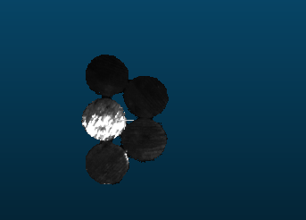
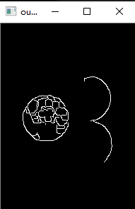
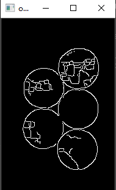

# 02-金属圆柱棒料紧贴竖放识别

## 描述

将金属（高反光的）圆柱竖放

## 采用算法测试

### 2D+3D

效果时好时坏。

主要存在的问题：
1. 亮度暗的时候点云成像质量好，但灰度图的边缘检测和轮廓提取效果很差
2. 亮度高的时候灰度图边缘检测和轮廓提取效果好，但点云成像质量很差

例如：
1、亮度小的时候：

可见亮度小的时候，虽然点云成像好，但提取出来的边缘很少，有些圆柱的边缘甚至完全提取不出来，连拟合都做不了。

2、亮度大的时候

、

可见亮度大的时候，点云成像效果较差，甚至有些圆柱的中心都出现了明显的点云缺失。但提取出来的边缘很多，轮廓提取很容易。

**尝试HDR功能**
尝试使用新版的HYpick，试试新增功能HDR是否会好点

### LCCP算法

### PPF算法
