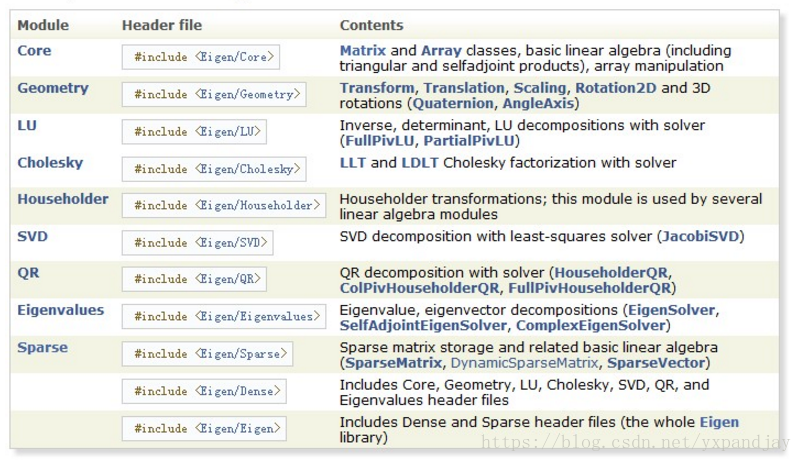

# Eigen概述

Eigen是一个C++的支持代数运算和数学分析的强大第三方库，很多地方都会用到它，例如SLAM， PCL库等……

## Core 核心

`#include <Eigen/Core>`

Matrix and Array classes, basic linear algebra (including triangular and selfadjoint products), array manipulation

矩阵和数组类，基本线性代数(包括三角形和自伴随乘积)，数组操作

## Geometry 几何

`#include <Eigen/Geometry>`

Transform, Translation, Scaling, Rotation2D and 3D rotations (Quaternion, AngleAxis)

变换，平移，缩放，旋转2d和3D旋转(四元数，AngleAxis)

## LU

`#include <Eigen/LU>`

Inverse, determinant, LU decompositions with solver (FullPivLU, PartialPivLU)

逆，行列式，LU分解与求解器(FullPivLU, PartialPivLU)

## Cholesky

`#include <Eigen/Cholesky>`

LLT and LDLT Cholesky factorization with solver

带求解器的LLT和LDLT Cholesky分解

## Householder

`#include <Eigen/Householder>`

Householder transformations; this module is used by several linear algebra modules

豪斯霍德变换;这个模块被几个线性代数模块使用

## SVD

`#include <Eigen/SVD>`

SVD decompositions with least-squares solver (JacobiSVD, BDCSVD)

SVD分解的最小二乘解算器(JacobiSVD, BDCSVD)

## QR

`#include <Eigen/QR>`

QR decomposition with solver (HouseholderQR, ColPivHouseholderQR, FullPivHouseholderQR)

使用求解器进行QR分解(HouseholderQR, ColPivHouseholderQR, FullPivHouseholderQR)

## Eigenvalues

`#include <Eigen/Eigenvalues>`

Eigenvalue, eigenvector decompositions (EigenSolver, SelfAdjointEigenSolver, ComplexEigenSolver)

特征值，特征向量分解(EigenSolver, SelfAdjointEigenSolver, ComplexEigenSolver)

## Sparse

`#include <Eigen/Sparse>`

Sparse matrix storage and related basic linear algebra (SparseMatrix, SparseVector)
(see Quick reference guide for sparse matrices for details on sparse modules)

稀疏矩阵存储及相关的基本线性代数(SparseMatrix, SparseVector)
(关于稀疏模块的详细信息，请参阅稀疏矩阵快速参考指南)

----

[官方参考文档](https://eigen.tuxfamily.org/dox/group__QuickRefPage.html)