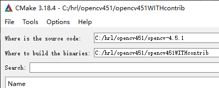
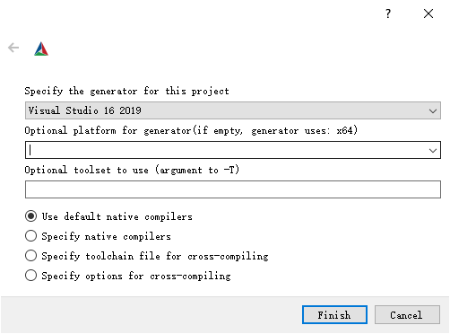

[toc]

# OpenCV-contrib(4.5.1) 安装编译

## 安装前的准备工作

1. cmake（如何安装参考我的笔记）
2. vs2019（这个就简单了，按C++开发的来就行）
3. 30G的磁盘空间
## 下载opencv

首先得下载opencv和opencv_contrib包的源码。

直接去github上下载release包

[opencv](https://github.com/opencv/opencv/releases/tag/4.5.1)

[opencv_contrib](https://github.com/opencv/opencv_contrib/releases/tag/4.5.1)

## 编译

点击configure

## 参考链接

https://blog.csdn.net/weixin_46135347/article/details/114190250
