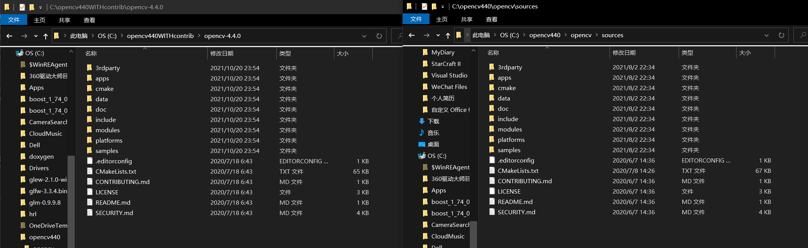
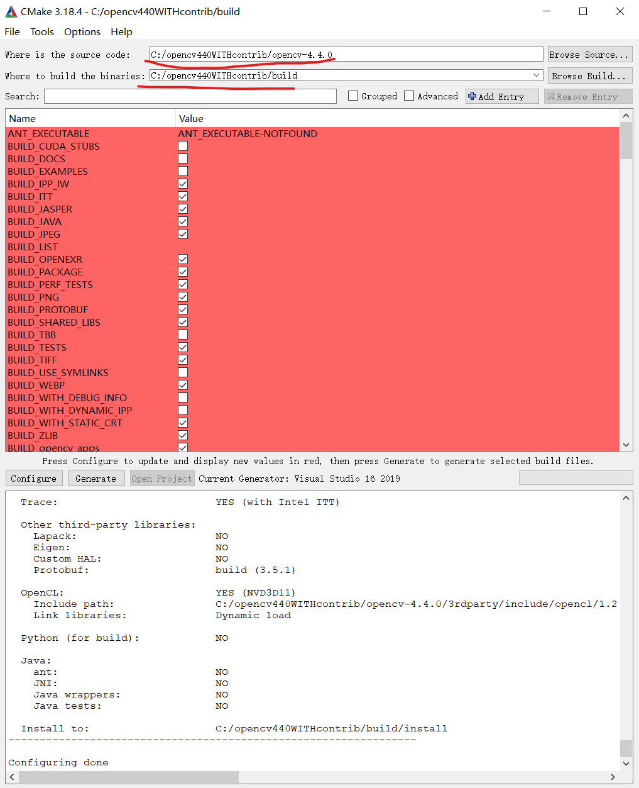
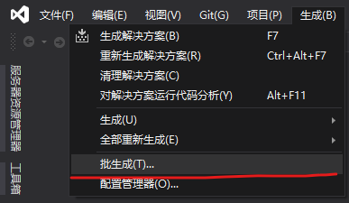
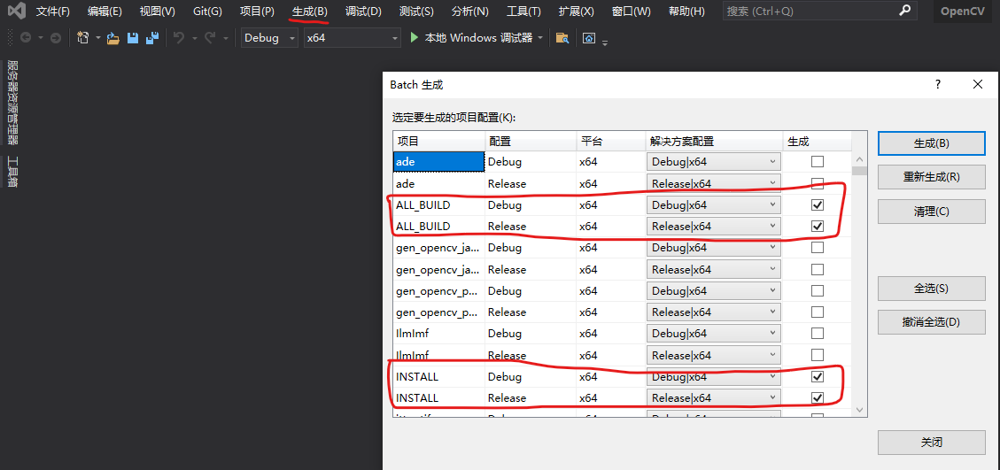
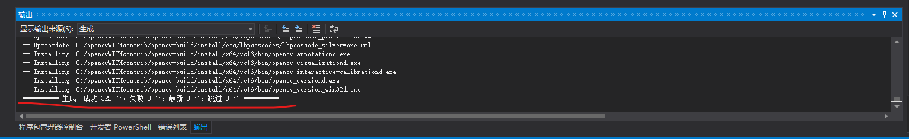
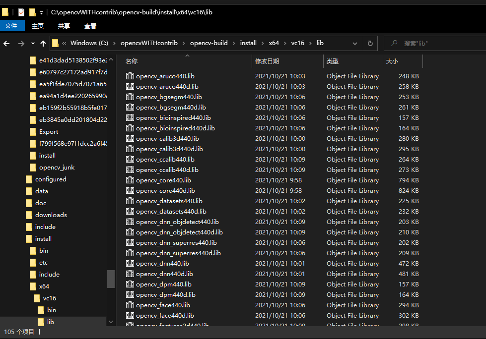
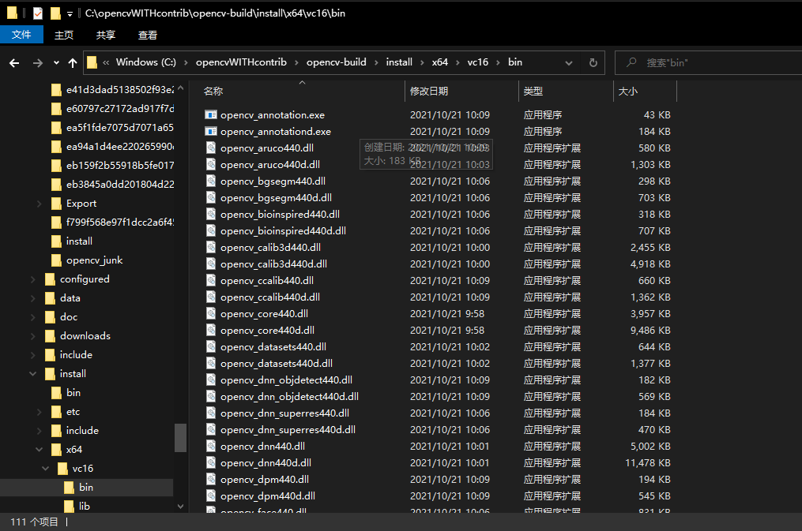

# OpenCV-contrib安装编译

## 安装前的准备工作

1. cmake（如何安装参考我的笔记）
2. vs2019（这个就简单了，按C++开发的来就行）

## 下载opencv

首先得下载opencv和opencv_contrib包的源码。

直接去github上下载release包

[opencv](https://github.com/opencv/opencv/releases/tag/4.4.0)

[opencv_contrib](https://github.com/opencv/opencv_contrib/releases/tag/4.4.0)

## 编译

在编译之前，我们不妨先看看，下载下来的opencv源码和在win10上用opencv440.exe安装出来的source有什么区别：



可以看到几乎是没啥区别的，貌似就是`CMakeList.txt`有点区别

----

注意opencv_contrib的编译其实就是在opencv编译的时候加个参数。

为了方便，我自己电脑上装了2个opencv4.4.0：
一个是普通的opencv，没有contrib包；
另一个就是加了contrib包的opencv4.4.0

反正用的时候分别写个属性表来让vs载入就行。（这两个属性表别同时用就行，不然……谁也不知道会发生什么事。）

----

### cmake gui生成

打开cmake gui
设置好路径，点击`configure`



一开始全红很正常，别紧张。
我们慢慢来……

记住：
**Slow is quick, quick is slow.**

当 CMake 界面上下两块都没有红色部分，且下方出现了Configuring done，点击generate按钮
第一次弄，还是建议当没有红色的时候，再点击`generate`

如果generate前没有红的话，generate是不会有问题的。

generate完了直接点击旁边的`open project`，这样就可以用vs打开工程了。

### vs生成

打开vs工程之后：

第一步


第二步


等个二十来分钟（时间会根据机子的性能而定），就生成好了



查看目录：
lib:


bin:


### 配置环境变量

参考opencv的配置方法

## 安装过程遇到的问题

### cmake configure

主要是一些包下载不下来的问题，详情参考链接。

主要思路就是：

1. 修改cmake文件里的下载链接
2. 事先下好文件，放到cmake指定的下载目录下

### vs2019编译遇到问题

错误代码	MSB3073	

命令
```bash
setlocal
"C:\Program Files\CMake\bin\cmake.exe" -DBUILD_TYPE=Debug -P cmake_install.cmake
if %errorlevel% neq 0 goto :cmEnd
:cmEnd
endlocal & call :cmErrorLevel %errorlevel% & goto :cmDone
:cmErrorLevel
exit /b %1
:cmDone
if %errorlevel% neq 0 goto :VCEnd
:VCEnd
```
已退出，代码为 1。	

INSTALL	C:\Program Files (x86)\Microsoft Visual Studio\2019\Community\MSBuild\Microsoft\VC\v160\Microsoft.CppCommon.targets	155	

其实从上面也是可以看出setlocal命令是：

```bash
setlocal
"C:\Program Files\CMake\bin\cmake.exe" -DBUILD_TYPE=$(Configuration) -P cmake_install.cmake
if %errorlevel% neq 0 goto :cmEnd
:cmEnd
endlocal & call :cmErrorLevel %errorlevel% & goto :cmDone
:cmErrorLevel
exit /b %1
:cmDone
if %errorlevel% neq 0 goto :VCEnd
```

严重性	代码	说明	项目	文件	行	禁止显示状态
错误	LNK1104	无法打开文件“..\..\lib\Debug\opencv_world440d.lib”	opencv_annotation	C:\opencvWITHcontrib\opencv_contrib-4.4.0\build\apps\annotation\LINK	1	

## 参考链接

### 编译

https://blog.csdn.net/weijifen000/article/details/93377143

### 问题解决

https://blog.csdn.net/Destiny_zc/article/details/107007432

