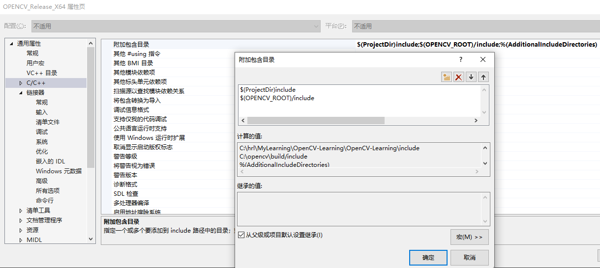
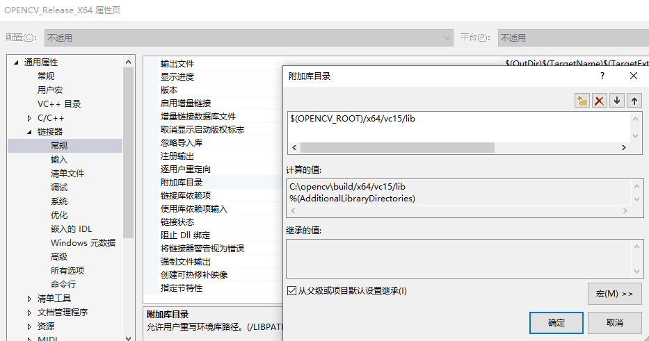
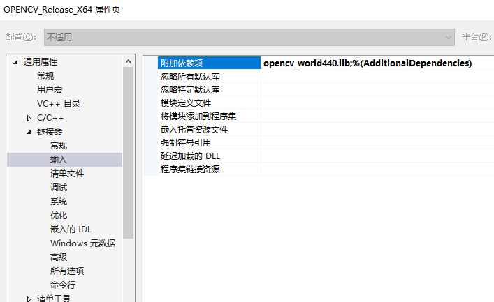

# OpenCV-contrib安装编译

## 安装前的准备工作

1. cmake（如何安装参考我的笔记）
2. vs2019（这个就简单了，按C++开发的来就行）

## 下载opencv

首先得下载opencv和opencv_contrib包的源码。

直接去github上下载release包

[opencv](https://github.com/opencv/opencv/releases/tag/4.4.0)

[opencv_contrib](https://github.com/opencv/opencv_contrib/releases/tag/4.4.0)

## 编译

在编译之前，我们不妨先看看，下载下来的opencv源码和在win10上用opencv440.exe安装出来的source有什么区别：


可以看到几乎是没啥区别的，貌似就是`CMakeList.txt`有点区别

----

注意opencv_contrib的编译其实就是在opencv编译的时候加个参数。

为了方便，我自己电脑上装了2个opencv4.4.0：
一个是普通的opencv，没有contrib包；
另一个就是加了contrib包的opencv4.4.0

反正用的时候分别写个属性表来让vs载入就行。（这两个属性表别同时用就行，不然……谁也不知道会发生什么事。）

----

### cmake gui生成

打开cmake gui
设置好路径，点击`configure`


一开始全红很正常，别紧张。
我们慢慢来……

记住：
**Slow is quick, quick is slow.**

当 CMake 界面上下两块都没有红色部分，且下方出现了Configuring done，点击generate按钮
第一次弄，还是建议当没有红色的时候，再点击`generate`

如果generate前没有红的话，generate是不会有问题的。

generate完了直接点击旁边的`open project`，这样就可以用vs打开工程了。

### vs生成

打开vs工程之后：

第一步


第二步


等个二十来分钟（时间会根据机子的性能而定），就生成好了


查看目录：
lib:


bin:


### 配置环境变量

参考opencv的配置方法

为了方便在vs中使用，我打算整个props属性表。

### 普通的opencv440：

**安装路径为**：
```bash
C:\opencv
```

**系统的环境变量**：`OPENCV_ROOT`：

```bash
C:\opencv\build
```

#### props设置（vs项目属性设置）:

`OPENCV_Release_X64.props`

**C/C++附加目录**：



```bash
$(OPENCV_ROOT)/include
```

**链接器——常规——附加库目录**：



```bash
$(OPENCV_ROOT)/x64/vc15/lib
```

**链接器——输入——附加表项**：



```bash
opencv_world440.lib
```

### opencv with opencv_contrib

**安装路径为**：

```bash
C:\opencvWITHcontrib
```

**系统环境变量** `OPENCV_CONTRIB_ROOT`：

```bash
C:\opencvWITHcontrib\opencv-build\install
```

#### props设置（vs项目属性设置）:

`OPENCV_Release_X64.props`

**C/C++附加目录**：

```bash
$(OPENCV_CONTRIB_ROOT)/include
```

**链接器——常规——附加库目录**：


```bash
$(OPENCV_CONTRIB_ROOT)/x64/vc16/lib
```

**链接器——输入——附加表项**：


**注意1**：
原来的普通的opencv是不需要一下子添加这么多lib的，可以通过设置cmake参数来使生成的lib只有`opencv_world440.lib`一个的。

**注意**：
lib这里是分Debug和Release的

Debug：
```bash
opencv_aruco440d.lib
opencv_bgsegm440d.lib
opencv_bioinspired440d.lib
opencv_calib3d440d.lib
opencv_ccalib440d.lib
opencv_core440d.lib
opencv_datasets440d.lib
opencv_dnn440d.lib
opencv_dnn_objdetect440d.lib
opencv_dnn_superres440d.lib
opencv_dpm440d.lib
opencv_face440d.lib
opencv_features2d440d.lib
opencv_flann440d.lib
opencv_fuzzy440d.lib
opencv_gapi440d.lib
opencv_hfs440d.lib
opencv_highgui440d.lib
opencv_img_hash440d.lib
opencv_imgcodecs440d.lib
opencv_imgproc440d.lib
opencv_intensity_transform440d.lib
opencv_line_descriptor440d.lib
opencv_ml440d.lib
opencv_objdetect440d.lib
opencv_optflow440d.lib
opencv_phase_unwrapping440d.lib
opencv_photo440d.lib
opencv_plot440d.lib
opencv_quality440d.lib
opencv_rapid440d.lib
opencv_reg440d.lib
opencv_rgbd440d.lib
opencv_saliency440d.lib
opencv_shape440d.lib
opencv_stereo440d.lib
opencv_stitching440d.lib
opencv_structured_light440d.lib
opencv_superres440d.lib
opencv_surface_matching440d.lib
opencv_text440d.lib
opencv_tracking440d.lib
opencv_video440d.lib
opencv_videoio440d.lib
opencv_videostab440d.lib
opencv_viz440d.lib
opencv_xfeatures2d440d.lib
opencv_ximgproc440d.lib
opencv_xobjdetect440d.lib
opencv_xphoto440d.lib
```

Release:
```bash
opencv_aruco440.lib
opencv_bgsegm440.lib
opencv_bioinspired440.lib
opencv_calib3d440.lib
opencv_ccalib440.lib
opencv_core440.lib
opencv_datasets440.lib
opencv_dnn440.lib
opencv_dnn_objdetect440.lib
opencv_dnn_superres440.lib
opencv_dpm440.lib
opencv_face440.lib
opencv_features2d440.lib
opencv_flann440.lib
opencv_fuzzy440.lib
opencv_gapi440.lib
opencv_hfs440.lib
opencv_highgui440.lib
opencv_img_hash440.lib
opencv_imgcodecs440.lib
opencv_imgproc440.lib
opencv_intensity_transform440.lib
opencv_line_descriptor440.lib
opencv_ml440.lib
opencv_objdetect440.lib
opencv_optflow440.lib
opencv_phase_unwrapping440.lib
opencv_photo440.lib
opencv_plot440.lib
opencv_quality440.lib
opencv_rapid440.lib
opencv_reg440.lib
opencv_rgbd440.lib
opencv_saliency440.lib
opencv_shape440.lib
opencv_stereo440.lib
opencv_stitching440.lib
opencv_structured_light440.lib
opencv_superres440.lib
opencv_surface_matching440.lib
opencv_text440.lib
opencv_tracking440.lib
opencv_video440.lib
opencv_videoio440.lib
opencv_videostab440.lib
opencv_viz440.lib
opencv_xfeatures2d440.lib
opencv_ximgproc440.lib
opencv_xobjdetect440.lib
opencv_xphoto440.lib
```

## 安装过程遇到的问题

### cmake configure

主要是一些包下载不下来的问题，详情参考链接。

主要思路就是：

1. 修改cmake文件里的下载链接
2. 事先下好文件，放到cmake指定的下载目录下

### vs2019编译遇到问题

错误代码	MSB3073	

命令
```bash
setlocal
"C:\Program Files\CMake\bin\cmake.exe" -DBUILD_TYPE=Debug -P cmake_install.cmake
if %errorlevel% neq 0 goto :cmEnd
:cmEnd
endlocal & call :cmErrorLevel %errorlevel% & goto :cmDone
:cmErrorLevel
exit /b %1
:cmDone
if %errorlevel% neq 0 goto :VCEnd
:VCEnd
```
已退出，代码为 1。	

INSTALL	C:\Program Files (x86)\Microsoft Visual Studio\2019\Community\MSBuild\Microsoft\VC\v160\Microsoft.CppCommon.targets	155	

其实从上面也是可以看出setlocal命令是：

```bash
setlocal
"C:\Program Files\CMake\bin\cmake.exe" -DBUILD_TYPE=$(Configuration) -P cmake_install.cmake
if %errorlevel% neq 0 goto :cmEnd
:cmEnd
endlocal & call :cmErrorLevel %errorlevel% & goto :cmDone
:cmErrorLevel
exit /b %1
:cmDone
if %errorlevel% neq 0 goto :VCEnd
```

严重性	代码	说明	项目	文件	行	禁止显示状态
错误	LNK1104	无法打开文件“..\..\lib\Debug\opencv_world440d.lib”	opencv_annotation	C:\opencvWITHcontrib\opencv_contrib-4.4.0\build\apps\annotation\LINK	1	

## 参考链接

### 编译

https://blog.csdn.net/weijifen000/article/details/93377143

### 问题解决

https://blog.csdn.net/Destiny_zc/article/details/107007432

