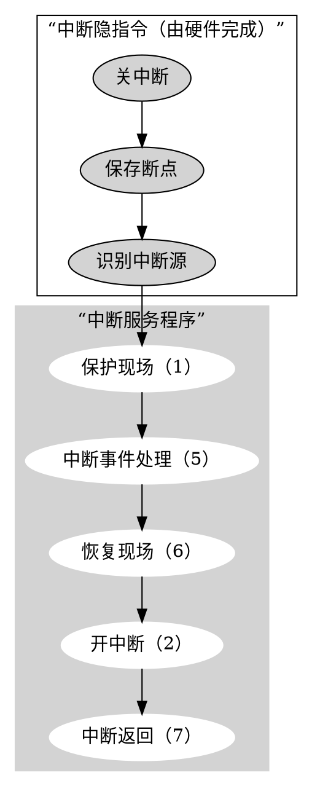
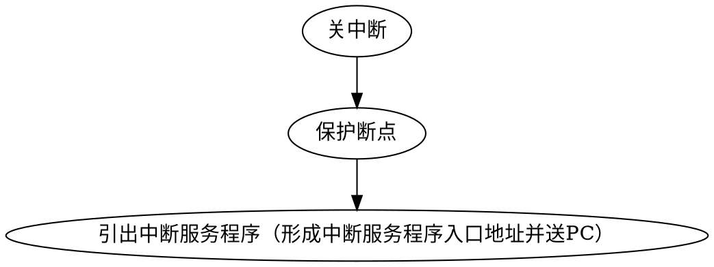

# 课本配套习题

## 选择题

## 填空题

1、I/O接口电路通常有？功能

## 例题

### 5.1 解释接口(interface)和端口(port)的概念

### 5.2 以键盘设备为例，说明其如何采用中断方式向CPU输入信息

# 《王道》

## 7.1

### 选择题

1、在微型机系统中，I/O设备通过（ ）与主板的系统总线相连接

A、DMA控制器
B、设备控制器
C、中断控制器
D、I/O端口

正解：

解析：

### 综合题

## 7.2

### 选择题

8、某磁盘的转速为10000转/分，平均寻道时间是6ms，磁盘传输速率是20MB/s，磁盘控制器延迟为0.2ms，读取一个4KB的扇区所需的平均时间约为？

A、9ms
B、9.4ms
C、12ms
D、12.4ms

正解：

解析：

11、若磁盘转速为7200转/分，平均寻道时间为8ms，每个磁道包含1000个扇区，则访问一个扇区的平均存取时间大约是？

A、8.1ms
B、12.2ms
C、16.3ms
D、20.5ms

正解：

解析：

### 综合题

## 7.3

### 选择题

2、在统一编址的方式下，区分存储单元和I/O设备是靠（ ）

A、不同的地址码
B、不同的地址线
C、不同的控制线
D、不同的数据线

正解：

解析：

4、下列关于I/O端口和接口的说法说法中，正确的是（ ）

A、按照不同的数据传送格式，可将接口分为同步传送接口和异步传送接口
B、在统一编制方式下，存储单元和I/O设备是靠不同的地址线来区分的
C、在独立编址方式下，存储单元和I/O设备是靠不同的地址线来区分的
D、在独立编址方式下，CPU需要设置专门的输入/输出指令访问端口

正解：

解析：

8、磁盘驱动器向盘片磁道记录数据时采用（ ）方式写入

A、并行
B、串行
C、并行-串行
D、串行-并行

正解：

解析：

10、下列有关I/O接口的叙述中，错误的是？

A、状态端口和控制端口可以合用同一个寄存器
B、I/O接口中CPU可访问的寄存器称为I/O端口
C、采用独立编址方式时，I/O端口地址和主存地址可能相同
D、采用统一编制方式时，CPU不能用访存指令访问I/O端口

正解：

解析：

### 综合题

## 7.4 I/O方式

### 选择题《王道》（Page 284）

#### 2、单级中断系统中，中断服务程序的执行顺序是（ ）
1. 保护现场
2. 开中断
3. 关中断
4. 保存断点
5. 中断事件处理
6. 恢复现场
7. 中断返回

A   1、5、6、2、7
B   3、1、5、7
C   3、4、5、6、7
D   4、1、5、6、7

正解：A

解析：
在单级（单重）中断系统中，不允许中断嵌套。则中断处理过程中为：

#### 5、若某设备中断请求的响应和处理时间是100ns，每400ns发出一次中断请求，中断响应所允许的最长延迟时间为50ns，则在该设备持续工作的过程中，CPU用于该设备的I/O时间占整个CPU时间的百分比至少为（ ）

A、12.5%
B、25%
C、37.5%
D、50%

正解：B

解析：
延迟时间50ns是不算进I/O时间的，故$$\frac{100ns}{400ns} \cdot 100\% = 25\%$$

#### 6、响应外部中断的过程中，中断隐指令完成的操作，除保护断点外还包括（ ）
1. 关中断
2. 保存通用寄存器的内容
3. 形成中断服务程序入口地址并送PC

A、仅 1、2
B、仅1、3
C、仅2、3
D、1、2、3

正解：B

解析：
中断隐指令的操作：

7、设置中断排队判优逻辑的目的是？

A、产生中断源编码
B、使同时提出的请求中的优先级别最高者得到及时响应
C、是CPU能方便地转入中断服务子程序
D、提高中断响应速度

正解：

解析：

9、以下说法中，错误的是（ ）

A、中断服务程序一般是操作系统模块
B、中断向量方法可提高中断源的识别速度
C、中断向量地址是中断服务程序的入口地址
D、重叠处理中断的现象称为中断嵌套

正解：

解析：

10、当有中断源发出请求时，CPU可执行相应的中断服务程序，可以提出中断的有（ ）

1. 外部事件
2. Cache
3. 浮点数运算下溢
4. 浮点数运算上溢

A、1,3
B、2,3,4
C、1,4
D、1,3,4

正解：

解析：

13、下列说法错误的是（ ）

1. 程序中断过程是由硬件和中断服务程序共同完成的
2. 在每条指令的执行过程中，每个总线周期要检查一次有无中断请求
3. 检测有无DNA请求，一般安排在一条指令执行过程的末尾
4. 中断服务程序的最后指令是无条件转移指令

A、3,4
B、2,3,4
C、2,4
D、1,2,3,4

正解：

解析：

14、能产生DMA请求的中线部件是（ ）

1. 高速外设
2. 需要与主机批量交换数据的外设
3. 具有DMA接口的设备

A、1
B、3
C、1,3
D、2,3

正解：

解析：

15、中断响应由高到低的优先次序宜用（ ）

A、访管->程序性->机器故障
B、访管->程序性->重新启动
C、外部->访管->程序性
D、程序性->I/O->访管

正解：

解析：

16、在具有中断向量表的计算机中，中断向量地址是（ ）

A、子程序入口地址
B、中断服务程序的入口地址
C、中断服务程序入口地址的地址
D、中断服务程序断点

正解：

解析：

17、中断响应是在（ ）

A、一条指令执行开始
B、一条指令执行中间
C、一条指令执行之末
D、一条指令执行的任何时刻

正解：

解析：

18、

正解：

解析：

19、主存故障引起的中断是（ ）

A、I/O中断
B、程序性中断
C、机器校验中断
D、外中断

正解：

解析：

20、在配有通道的计算机系统中，用户程序需要输入/输出时，引起的中断是（ ）

A、访管中断
B、I/O中断
C、程序中断
D、外中断

正解：

解析：

23、在中断响应周期中，CPU主要完成的工作是（ ）

A、关中断，保护断点，发中断响应信号并形成向量地址
B、开中断，保护断点，发中断响应信号并形成向量地址
C、关中断，执行中断服务程序
D、开中断，执行中断服务程序

正解：

解析：

24、在中断周期中，由（ ）将允许中断触发器置0

A、关中断指令
B、中断隐指令
C、开中断指令
D、中断服务程序

正解：

解析：

27、下列关于多重终端系统的叙述中，错误的是（ ）

A、在一条指令执行结束时响应中断
B、中断处理期间CPU处于关中断状态
C、中断请求的产生与当前指令的执行无关
D、CPU通过采样中断请求信号检测中断请求

正解：

解析：

29、在各种I/O方式中，中断方式的特点是（ ），DMA方式的特点是（ ）

A、CPU与外设串行工作，传送与主程序串行工作
B、CPU与外设并行工作，传送与主程序串行工作
C、CPU与外设串行工作，传送与主程序并行工作
D、CPU与外设并行工作，传送与主程序并行工作

正解：

解析：

31、下列叙述中，（ ）是正确的

A、程序中断方式和DMA方式中实现数据传送都需要中断请求
B、程序中断方式中有中断请求，DMA方式中没有中断请求
C、程序中断方式和DMA方式都有中断请求，但目的不同
D、DMA要等指令周期结束时才可以进行周期窃取

正解：

解析：

32、以下关于DMA方式进行I/O的描述中，正确的是（ ）

A、一个完整的DMA过程，部分由DMA控制器控制，部分由CPU控制
B、一个完整的DMA过程，完全由CPU控制
C、一个完整的DMA过程，完全由DMA控制器控制，CPU不介入任何控制
D、一个完整的DMA过程，完全由CPU采用周期挪用法控制

正解：

解析：

33、CPU响应DMA请求的条件时当前（ ）执行完

A、机器周期
B、总线周期
C、机器周期及总线周期
D、指令周期

正解：

解析：

34、下列关于中断I/O方式和DMA方式比较的叙述中，错误的是（ ）

A、中断I/O方式请求的是CPU处理时间，DMA方式请求的是总线使用权
B、中断响应发生在一条指令执行结束后，DMA响应发生在一个总线事务完成后
C、中断I/O方式下数据传送通过软件完成，DMA方式下数据传送由硬件完成
D、中断I/O方式适用于所有外部设备，DMA方式仅适用于快速外部设备

正解：

解析：

35、关于中断和DMA，下列说法正确的是？

A、DMA请求和中断请求同时发生时，响应DMA请求
B、DMA请求、非屏蔽中断、可屏蔽中断都要在当前指令结束后才能被响应
C、非屏蔽请求优先级最高，可屏蔽中断请求优先级最低
D、若不开中断，所有中断请求就不能响应

正解：

解析：

37、在主机和外设的信息传送中，（ ）不是一种程序控制方式

A、直接程序传送
B、程序中断
C、直接存储器存取（DMA）
D、通道控制

正解：

解析：

### 综合题