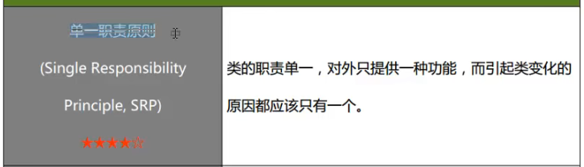
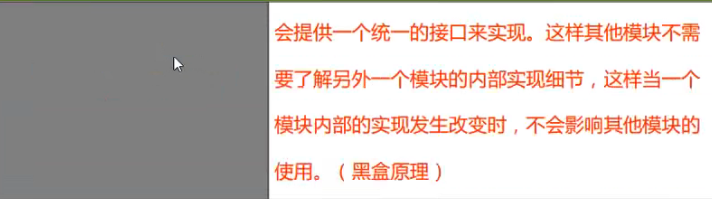
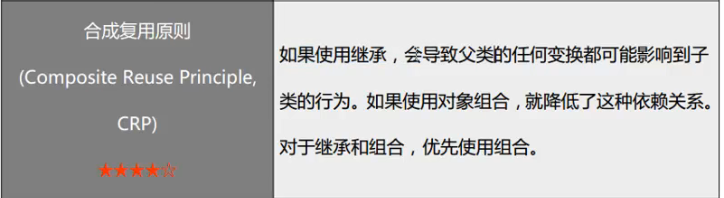

# 设计模式(design-pattern)

这是关于设计模式的学习笔记。

设计模式很重要，想要软件写得好，从初级程序员进阶到高级工程师，这是必不可少的能力。

## 设计模式的分类

1. 创建型模式
2. 结构型模式
3. 行为型模式

上述三类共有23种，另有一种事简单工厂模式，即共有24种

## 设计模式的学习目的

其实就是要学会回答以下问题：
1. 如何将代码分散在几个不同的类中？
2. 为什么要有“接口”？
3. 什么是针对抽象编程？
4. 何时不应该使用继承？
5. 如何不修改源代码增加新功能？
6. 能够更好地阅读和理解现有类库和其它系统的源代码

## 学习的建议

1. 不要背类图而是要背案例
   1. 学会具体情况具体分析，根据业务的实际场景来选择合适的设计模式
2. 不要拘泥于某一种设计模式，灵活使用，设计模式说白了就是编程的思想

## 设计模式的原则

### 原则的目的

* 可维护性
  * 添加新功能不需要对原有的修改或者少修改
* 可复用性
  * 原有的用起来简单方便
* 高内聚，低耦合
  * 一个类，一个函数就做一件事，这样如果出了问题好排查原因

原则：
1. 单一职责原则
2. 开闭原则
3. 里氏代换原则
4. 依赖倒转原则
5. 接口隔离原则
6. 合成复用原则
7. 迪米特法则（最小知识原则）

### 单一职责原则

类的职责单一，对外只提供一种功能，而引起类变化的原因都应该只有一个。

一个类只做一件事，不然大项目里不好维护

### 开闭原则

Open-Closed Principle OCP

对扩展开放，对修改关闭

类的改动是通过增加代码进行的，而不是修改源代码

### 迪米特法则

Law of Demeter, LoD

具体做法大概就是弄一个中间类，只提供必要的接口，只读取必要的数据，只输出必要的结果。

### 合成复用原则

Composite Reuse Principle, CRP

